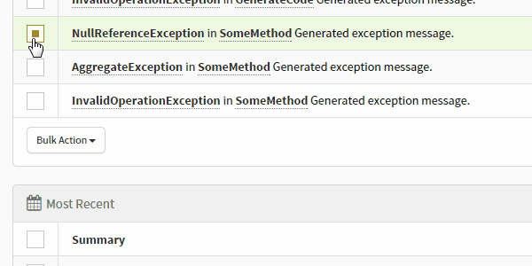
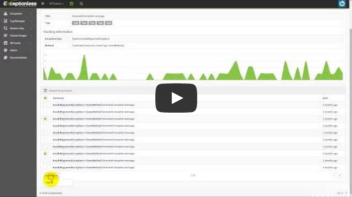

Bulk Actions is the ability to select multiple exceptions or occurrences of a single exception and do with them as you please, all at once. Simply select multiple occurrences, click the "Bulk Actions" button below the list, and choose your action.

## Watch the Video!

---

[Next > Project Settings](project-settings) {.text-right}