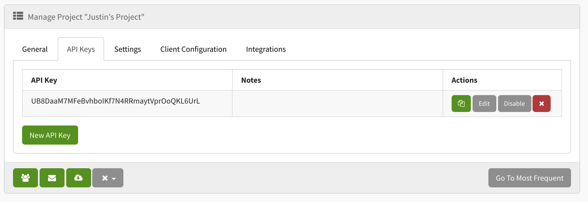

Exceptionless provides a [.NET Client](../dotnet/index.md) and a [JavaScript Client](../javascript/index.md) to make things convenient. However, we recognize that developers write code in all sorts of languages beyond .NET and JS. It is possible to use Exceptionless with any programming language. In fact, our API makes it really simple. However, to get the full power of Exceptionless, you may want to create your own custom client in the language of your choice.

This guide will focus on the concepts necessary to successfully implement your custom client. Building a client in Exceptionless requires three main things: 

1. Authentication 
2. Understanding of the data models
3. Usage of the correct API endpoints

### Authentication

One of the key things to understand when creating a custom client (or when using the Exceptionless API) is the security implications of the API token generated and used. Exceptionless has two types of API tokens: 

* User-scoped
* Client/Project-scoped

Think of a user-scoped key as the master key for that particular user. It allows for EVERYTHING. This includes password resets, deleting organizations, deleting users, and more. This is not the type of key you want to generate with your custom client. You also don't want to manually generate and use these types of keys within your client. 

Instead, you should use a client-scoped key. A client-scoped key only has access to very specific endpoints and provides a significantly increased level of security compared to using a user-scoped key. 

In the Exceptionless UI, you can create a project API key by going to a project's settings page. To do so, click on the project dropdown in the top-menu, hover over the project's name, and then click the gear icon. On the settings page, you'll see an API Keys tab. Click that and you can generate a new client-scoped key. 



This is the key that will need to be passed into the configuration settings of your custom client. 

### Understanding the Data Models

Exceptionless is designed to be as flexible as possible. In fact, you can send in almost any data you want with an event. We will display some pieces of data better than others, and if you make use of well-known keys, we can use those to make sure your events are stacked properly and displayed in a usable way within your dashboard. 

However, before you can begin to throw any and everything at Exceptionless, it's important to understand the basic structure of an event. Let's take a look at the event model: 

```json
{
  "type": "error",
  "source": "code.js line 655",
  "reference_id": "123",
  "message": "some event message",
  "geo": "stringified lat and long values separated by a comma",
  "date":"2030-01-01T12:00:00.0000000-05:00",  
  "value": 0,
  "tags": ["string", "string", "string"],
  "data": {},
}
```

Let's take each of these properties and explain them one-by-one. 

#### type 

The type property is an important one because it tells Exceptionless how to treat your event. Remember that Exceptionless is not just for errors. If you look at your Dashboard, you'll see categories like Exceptions, Logs, and Feature Usage. We group events into these categories for you based on the `type` value you pass in. 

You can pass in any type value you'd like as long as it is a string value. However, we recommend the following type values: 

* error
* log
* usage
* 404
* session
* sessionend

These values are pretty self-explanatory. If you have an error, use the `error` value, if you are logging an event, use `log`, and so on and so forth. 

#### source 

The source value should be a string representing where the error happened in your code. This usually comes from the error object in whatever programming language you are writing in. This should be a string value representing the error location.

#### reference_id

The reference id is an identifier you can pass in in order to use later. For example, if you know that you will have other events that reference this one, you can make use of the reference identifier you pass in. This identifier can be any unique string value. UUID is good option here, but as long as the value is unique, you'll be good to go. 

#### message

The message can mean different things depending on the type of event you're passing through. If it's an error event, you may want to pick off the error message from the error object you receive, or you may want to create a custom error message. For a log event, you can simply pass in whatever message makes sense for the event. 

Whatever message you send through, just make sure it is a string value. 

#### geo

If you are capturing ip information, you may have location-based information. If so, and if you want to capture that alongside your events, you can pass that as a value for the `geo` property. This needs to be a string value, so you should pass in the longitude followed by a comma then the latitude.

#### value

The value property is an open-ended integer field that allows you capture additional information about your events. This could be number of ice cream scoops served before the event happened, it could be number of dogs walked, or any other arbitrary piece of information. 

#### tags

The tags property is a string array of values you want to use to categorize your events. We have some built-in understanding of how certain tags should work. For example, events with a "critical" tag will be labels and handled as such in the interface. 

The tags array takes string values only, and all tags will be visibile on the event details page. 

#### data

This is the most flexible of the properties that you send into Exceptionless. It is a disctionary object containing key/value pairs of any bits of information you want. That said, there are some know keys that will help Exceptionless better display information in this data dictionary: 

`@error` - this indicates to Exceptionless that the event is an error. We will handle the event as such. 
`@simple_error` - this, like @error, indicates that the event is in an error. However, a simple error is less complex and the event object itself fits more neatly into what we've defined here so far. 
`@request` - Events from a web server will have a request object. That information can be stringified and passed to Exceptionless with this key. 
`@environment` - This would be a string environment about your user's environment. Is the application a console app? A desktop GUI? A web app? That information can be captured here. 
`@user` - This is an object that can contain the following: `identity`: string value, `name`: string value, `data`: any value.
`@user_description` - This is an object that can contain the following: `email_address`: string value, `description`: string value, `data`: any value. 
`@level` - This is designed for log events to represent the log level. It can also be used to prevent logs from being captured depending on your log level settings in Exceptionless. 
`@submission_method` - Many apps have both global event listeners and specific areas where an event can be captured manually or ad hoc. To separate the submission methods of events, you can pass in whether an event was captured in a global listener, ad hoc, or however you want to describe the capturing of the event. 
`@stack` - This is the stringified error stack for an exception. 

When providing data to the Exceptionless server, there are specific data models dependent on the information you're trying to provide. We'll cover those models here. 

**User Info**

**Event Models**

There are three types of events in Exceptionless: 

* Exceptions/Errors
* Logs
* General events

Let's take a look at the models for each of these types, starting with the most complex to the least. 

**Errors**

Error events have some very specific data structures. They need to include a `type` property of `error`, a `date` property formatted as an ISOString, and a custom error property. This property is generally prefixed with an `@` symbol and should reference the error type. Let's take a look at the JSON structure of an error event: 

```json
{ 
  "type": "error", 
  "date":"2030-01-01T12:00:00.0000000-05:00", 
  "@simple_error": { 
    "message": "Simple Exception", 
    "type": "System.Exception", 
    "stack_trace": " at Client.Tests.ExceptionlessClientTests.CanSubmitSimpleException() in ExceptionlessClientTests.cs:line 77" 
  } 
}
```

Note that the error property should be an object containing infomation about the actual error. This should include string values for `message`, `type`, and `stack_trace`.

You can explore and test error events on our [API documentation site here](https://api.exceptionless.io/docs/index.html). Events can be sent to Exceptionless via a `GET` or a `POST` request. 

`GET` - `/api/v2/events/submit` 

If you use the `GET` request, you will need to pass in your event information as query string parameters. This might look like: 

`/events/submit?access_token=YOUR_API_KEY&type=error&date%3D2030-01-01T12%3A00%3A00.0000000-05%3A00%26%40simple_error%3D%7Bmessage%3ASimple%20Exception%2C%20type%3ASystem.Exception%2C%20stack_trace%3A%20%20at%20Client.Tests.ExceptionlessClientTests.CanSubmitSimpleException%28%29%20in%20ExceptionlessClientTests.cs%3Aline%2077`

Notice that you must url encode your properties for this to work. 

If you would like to use the more traditional `POST` request, you will use the following endpoint: 

`POST` - `/api/v2/events` 

You'll send the JSON event into in the body of the request. 

Here's the full model for the error type: 

`@error`: 

```js
{
  module: {
    data: any;
    module_id?: number;
    name?: string;
    version?: string;
    is_entry?: boolean;
    created_date?: Date;
    modified_date?: Date;
  }
}
```

You can see a [Typescript example here](https://github.com/exceptionless/Exceptionless.JavaScript/blob/master/src/models/IError.ts).

**Logs**

When submitting a log, you need to provide specific information about the log event. The model for a log event includes a `type` property of `log`, a `meassage` property that includes the message string for the log, and a `date` property in ISOString format. Optionally, you can pass in user info in a `@user` object property that includes properties specific to the user. 

Here's a basic JSON example of a log event: 

```json
{ 
  "type": "log", 
  "message": "Exceptionless is amazing!", 
  "date":"2030-01-01T12:00:00.0000000-05:00", 
  "@user":{ 
    "identity":"123456789", 
    "name": "Test User" 
  } 
}
```

You can explore and test log events on our [API documentation site here](https://api.exceptionless.io/docs/index.html). Events can be sent to Exceptionless via a `GET` or a `POST` request. 

`GET` - `/api/v2/events/submit` 

If you use the `GET` request, you will need to pass in your event information as query string parameters. This might look like: 

`/events/submit?access_token=YOUR_API_KEY&type=log&message=Hello World&source=server01&geo=32.85,-96.9613&randomproperty=true`

If you would like to use the more traditional `POST` request, you will use the following endpoint: 

`POST` - `/api/v2/events` 

You'll send the JSON event into in the body of the request. 

A log event, as with many other events can accept an `@user` property. This property has a specific data model you'll want to conform to. Here's an example: 

```js
{
  identity?: string;
  name?: string;
  data?: any;
}
```

You may also need to pass in a user description. That model is defined like this: 

```js
{
  email_address?: string;
  description?: string;
  data?: any;
}
```

You can see a Typescript example of the [user info model here](https://github.com/exceptionless/Exceptionless.JavaScript/blob/master/src/models/IUserInfo.ts), and the [user description model here](https://github.com/exceptionless/Exceptionless.JavaScript/blob/master/src/models/IUserDescription.ts). 

**General Events**

General events don't fit neatly into any one category. They can be used for a variety of things. They look similar to log events but they are not governed by log level settings in your application or in Exceptionless. 

A simple general event has one required property: `message`. Here's a JSON example of a general event: 

```json
{ 
  "message": "Exceptionless is amazing!" 
}
```

You can explore and test general events on our [API documentation site here](https://api.exceptionless.io/docs/index.html). Events can be sent to Exceptionless via a `GET` or a `POST` request. 

`GET` - `/api/v2/events/submit` 

If you use the `GET` request, you will need to pass in your event information as query string parameters. This might look like: 

`/events/submit?access_token=YOUR_API_KEY&message=Exceptionless!`

If you would like to use the more traditional `POST` request, you will use the following endpoint: 

`POST` - `/api/v2/events` 

You'll send the JSON event into in the body of the request. 

**Other Date Models** 

As part of sending events through to Exceptionless, you may need to provide additional information. For example, you may need to provide information about the user's environment, or you may need to extend the request information. Fortunately, both of these examples have well-formed data models you can leverage. 

Here's an example of the EnvironmentInfo model: 

```js
{
  processor_count?: number;
  total_physical_memory?: number;
  available_physical_memory?: number;
  command_line?: string;
  process_name?: string;
  process_id?: string;
  process_memory_size?: number;
  thread_id?: string;
  architecture?: string;
  o_s_name?: string;
  o_s_version?: string;
  ip_address?: string;
  machine_name?: string;
  install_id?: string;
  runtime_version?: string;
  data?: any;
}
```

You can see this full example [in Typescript here](https://github.com/exceptionless/Exceptionless.JavaScript/blob/master/src/models/IEnvironmentInfo.ts). 

And here's an example of the RequestInfo model: 

```js
{
  user_agent?: string;
  http_method?: string;
  is_secure?: boolean;
  host?: string;
  port?: number;
  path?: string;
  referrer?: string;
  client_ip_address?: string;
  cookies?: any;
  post_data?: any;
  query_string?: any;
  data?: any;
}
```

The full example of that model in [Typescript can be found here](https://github.com/exceptionless/Exceptionless.JavaScript/blob/master/src/models/IRequestInfo.ts).

As you can see these models allow you to pass in a lot of information that can make your experience understanding your application's functionality and possible defects much easier. If you are building a custom client for Exceptionless, it is critical to understand the shape of the data you plan to send to the server to ensure the data is handled and used properly in the interface. 

### Wrapping Up 

A custom client gives you full flexibility. While the two clients provided by Exceptionless do all of the above work for you, extending them would require forking the code. If you want extended capabilities or client support for additional programming languages, building a custom client might be the right move for you. 

We can't way to see what you build.