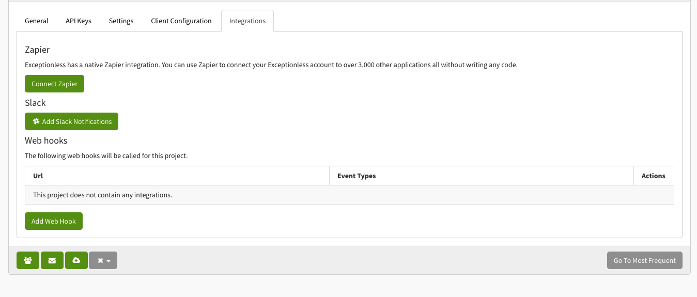
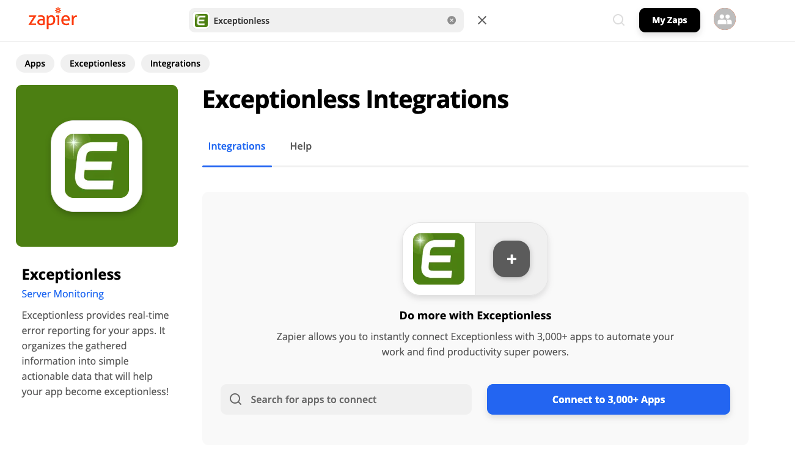
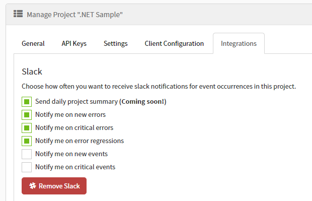
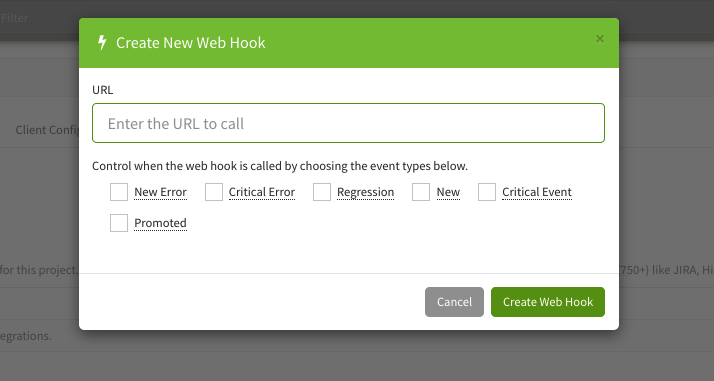

To make managing events from your application easier, Exceptionless provides some useful integrations. You can access these integrations by clicking the Project dropdown menu, clicking the settings icon next to the project name, then clicking on the Integrations tab on the Settings page.



We provide three integrations:

1. Zapier
2. Slack
3. Webhooks

## Zapier

Exceptionless has built a [first-class Zapier application](https://zapier.com/apps/exceptionless/integrations) that allows you to connect your Exceptionless account to over 3,000 other apps. To use this, simply sign into your Zapier account and search for Exceptionless.



## Slack

Connecting to Slack is as simple as clicking the Slack integration button. You'll be prompted to sign into your Slack workspace. Once signed in, you can choose the channel for your notifications to be sent to. Then, back on the Settings page, you can configure what types of notifications are sent.



## Webhooks

By configuring a webhook, you are telling Exceptionless to post data to the specified endpoint whenever specific events happen. This is useful in creating custom, bespoke integrations for your Exceptionless account. Configuring a webhook is simple. Click the Add Webhook button on the Settins page and provide the information requested in the modal.



Here's an example of the event payload (this applies to v2 of the Exceptionless API):

```json
{
  "id": "22cd0826e447a44e78877a22",
  "url": "http://localhost:5200/event/22cd0826e447a44e78877a22",
  "occurrence_date": "2014-01-17T14:37:02.739-06:00",
  "type": "error",
  "message": "A potentially dangerous Request.Path value was detected from the client (&).",
  "project_id": "537650f3b77efe23a47914f4",
  "project_name": "Disintegrating Pistol",
  "organization_id": "537650f3b77efe23a47914f3",
  "organization_name": "Acme",
  "stack_id": "1ecd0826e447a44e78877ab1",
  "stack_url": "http://localhost:5200/stack/1ecd0826e447a44e78877ab1",
  "stack_title": "A potentially dangerous Request.Path value was detected from the client (&).",
  "stack_tags": [
    "Test"
  ],
  "total_occurrences": 0,
  "first_occurrence": "2014-01-17T20:37:02.739Z",
  "last_occurrence": "2014-01-17T20:37:02.739Z",
  "is_new": false,
  "is_regression": false,
  "is_critical": false
}
```

To see both v1 and v2 models for events and stacks, [see this link](https://github.com/exceptionless/Exceptionless/tree/master/tests/Exceptionless.Tests/Plugins/WebHookData).

---

[Next > FAQ](FAQ.md) {.text-right}
