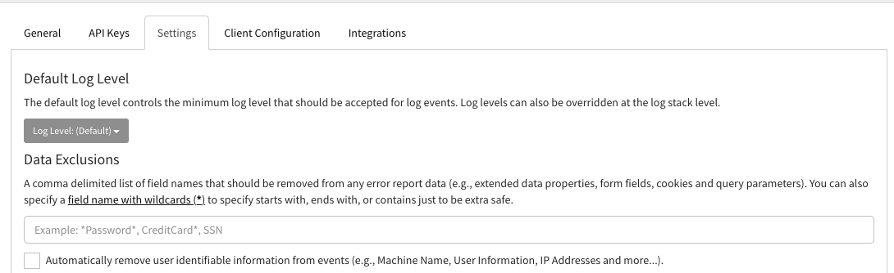
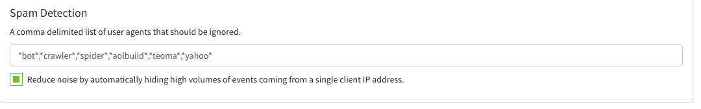

Exceptionless is different from most error monitoring services in that it provides you with real-time updates. That includes updates from your Exceptionless project settings to your client. What does that mean? 

All project settings are synced to the client in almost real time, so when an event is submitted to Exceptionless we send down a response header with the current configuration version. If a newer version is available we will immediately retrieve and apply the latest configuration. We will also periodically check for newer configuration when the client is idle.

By default the client will check after `5 seconds` on client startup (*if no events are submitted on startup*) and then every `2 minutes` after the last event submission for updated configuration settings.

- Checking for updated settings doesn't count towards plan limits.
- Only the current configuration version is sent when checking for updated settings (no user information will ever be sent).
- If the settings haven't changed, then no settings will be retrieved.

You can also **turn off the automatic updating of configuration settings when idle** in each client respectively. Please see the [client specific documentation](#clients).

Now, let's take a look at the available settings for your projects. There are quite a few, so feel free to jump to the section that interests you below: 

<!-- - [Clients](#clients) -->
- [Data Exclusions](#data-exclusions)
  - [Example usage](#example-usage)
- [Error Stacking](#error-stacking)
- [User Namespaces](#user-namespaces)
- [Common Methods](#common-methods)
- [Spam Detection](#spam-detection)
- [Client Configuration](#client-configuration)
- [Event Exclusions](#event-exclusions)
  - [Example](#example)
- [Using Client Configuration Settings](#using-client-configuration-settings)

---

<!-- ## Clients

Exceptionless has a robust API that can be used through any client interface, but as a convenience, we have provided two Exceptionless client wrappers—one for .NET and one for JavaScript.

Each client wrapper has its own guide to help you get started. Visit either one below. 

- [.NET](clients/dotnet/)
- [JavaScript / Node.js](clients/javascript/) -->

## Data Exclusions

Data can be excluded from your error reports by specifying the information you'd like excluded. This is especially important when you are dealing with sensitive information. For example, an error on log in might, by default, send a user's password to our server. You probably don't want that, so you can exclude that type of data from being sent. For more on how we handle security issues, check out our [security page](security).

To get started, go to your project settings page, click the Settings tab. 

A comma delimited list of field names that should be removed from any error report data (e.g., extended data properties, form fields, cookies and query parameters). Data Exclusions can be configured on the project settings page. You can also specify a field name with wildcards `*` to specify starts with, ends with, or contains just to be extra safe.

### Example usage

- Entering `Password` will remove any field **named** `Password` from the report.
- Entering `Password*` will remove any field that **starts with** `Password` from the report.
- Entering `*Password` will remove any field that **ends with** `Password` from the report.
- Entering `*Password*` will remove any field that **contains** `Password` from the report.

---

## Error Stacking

You can also control how errors are stacked by specifying user namespaces (if you application code utilizes namespaces) or common methods (in all apps) to ignore. Let's take a look at how each works. 

### User Namespaces

If your app runs on .NET or other languages that support namespaces, you can define what namespaces your code runs in. This allows Exceptionless to pick a stacking target within your code. 

You can set this up on the project settings page in the Settings tab. You simply need to provide, a comma delimited list of the namespace names that your applications code belongs to. If this value is set, only methods inside of these namespaces will be considered as stacking targets.

### Common Methods

Slightly different from your namespace definitions above, defining common methods here will *exclude* stacks from building up for specified methods. This is important as you may have catch-all methods in your code or specific methods that you expect to have frequent errors you'd rather not pass to Exceptionless. 

You can set this up on the project settings page in the Settings tab. Simply supply a comma delimited list of common method names that should not be used as stacking targets. 

---

## Spam Detection

Spam detection allows you to prevent noise from being tracked. Bots crawling your site or app can contribute to stacks that you simply do not want to see or track. We make it easy to filter these out. 

On your project settings page, click the Settings tab and scroll down to the Spam Detection section. There, you can also specify a comma delimited list of user agents that should be ignored client side. This list supports wildcards and by default covers a vast major of bots. 

**Automatic Spam Detection**

We also provide you with a simple tool to automatically detect spam from a single IP address sending in a high volume of activity. Click the checkbox, and we will do the rest.

---

## Client Configuration

Custom client configuration values allow you to control the behavior of your app in real time. They are a dictionary of key value pairs (string key, string value). Usage examples include controlling data exclusions to protecting sensitive data and or enabling/disabling features. 

To set up custom client configurations, click the All Projects drop down in the navigation header when you are signed into Exceptionless. Then, hover over your project name and you'll see a gear icon. Click that icon. This will take you to your project settings screen where you can click the tab called Client Configuration.

## Event Exclusions

The Exceptionless clients have the ability to automatically discard events based on client configuration settings. We have a plugin that looks at the client configuration settings using a simple key name convention.

To help us understand this consider that every event has a `Type` and `Source` property. The `Type` can be anything but we have a few first class types like [`error`, `usage`, `log`, `404`, `session`](https://github.com/exceptionless/Exceptionless/blob/master/src/Exceptionless.Core/Models/Event.cs#L92-L100). `Source` is usually set to the exception type when dealing with `error` events or the `log` source.

With that said, you can exclude any event type and source by adding a new client configuration key `@@EVENT_TYPE:SOURCE` by replacing the `EVENT_TYPE` and `SOURCE` respectively and specify a configuration value of `false`. _You can also specify a wild card `*` as part of the `SOURCE`._

### Example

- To discard all errors of type `System.ArgumentNullException`:
  - **KEY:** `@@error:System.ArgumentNullException`
  - **VALUE:** `false`

- To discard all errors in general you would use a wildcard `*`:
  - **KEY:** `@@error:*`
  - **VALUE:** `false`

- To discard all 404s in general you would use a wildcard `*`:
  - **KEY:** `@@404:*`
  - **VALUE:** `false`

We have also added some additional known values to support **minimum log levels**. The known values are: `Trace`, `Debug`, `Info`, `Warn`, `Error`, `Fatal`, `Off`.

- Sets a minimum log level of `Info` for my application:
  - **KEY:** `@@log:*`
  - **VALUE:** `Info`

- You can also set a log level on a per log source basis. This will override any general minimum log level (e.g., `@@log:*` you have defined!
  - **KEY:** `@@log:*AuthController`
  - **VALUE:** `Trace`

## Using Client Configuration Settings

- [.NET](clients/dotnet/client-configuration-values.md)
- [JavaScript / Node.js](clients/javascript/client-configuration-values.md)

---

[Next > Filtering & Search](filtering-and-search) {.text-right}