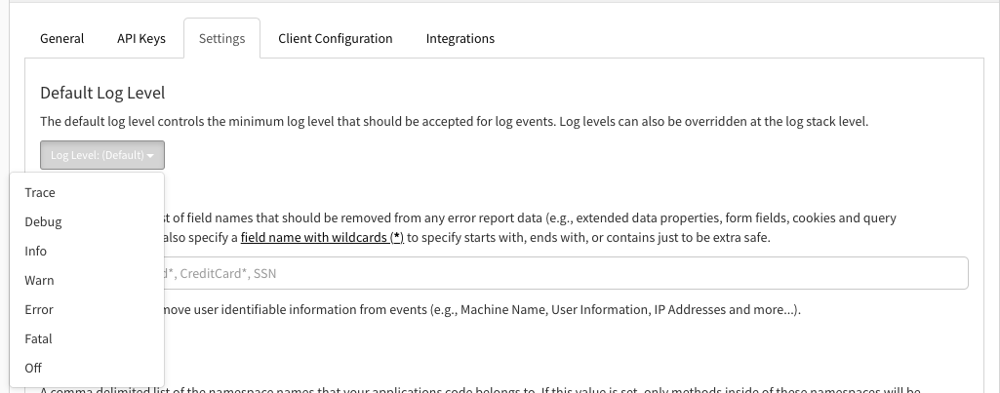
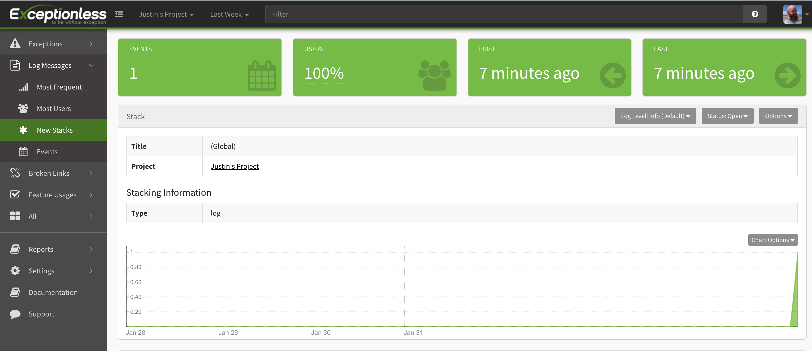
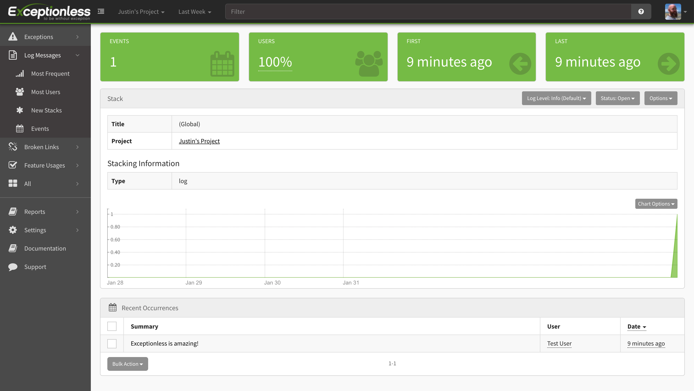
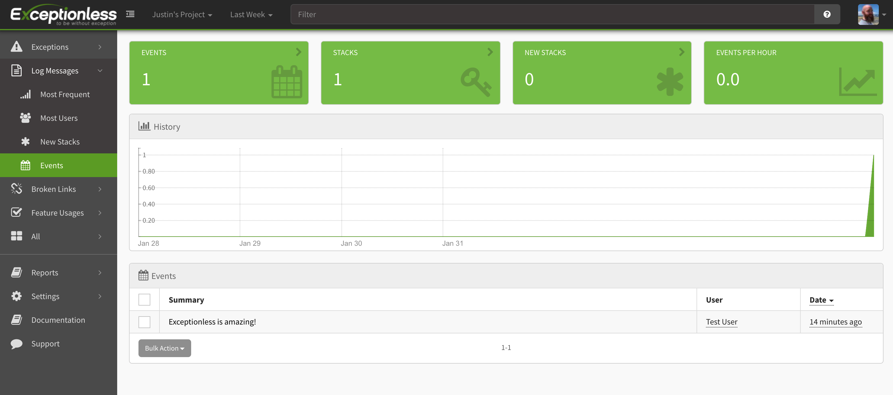
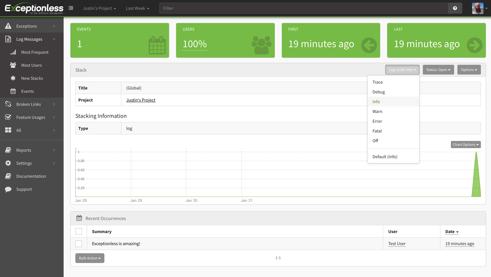

Setting log levels allows you to control the flow of data into your Exceptionless account. This is important when you are trying to filter the signal from the noise. In most error monitoring services, you would need to manually configure what log levels are used to send events by customizing your code. With Exceptionless, you can update the log levels used right in the Exceptionless UI. 

To configure your default log levels, go to your project settings page by clicking the project name dropdown in the top left of the header. Hover over your project name, then click the gear icon. Once on the project settings page, click the Settings tab. Here, you will see the default log level options. 

 

You can change this at the project level or overide the setting on the Stacks page. To override the global log level, click on "Log Messages" on the left side of your screen: 

Next, you'll want to do one of two things: 
 

### 1. Click on "New Stacks" and then click on the log stack you'd like to change.
 

The new stacks tab is on the left under Log Messages: 

 

When you click that link, you can click on the log stack and it will take you to this page: 

 

### 2. You can click on a log message event from the Log Messages -> Events dashboard or the All -> Events dashboard, then you can click on a particular log message and click Go To Stack. 
 
If you click Events, you'll see all log events (or all events depending on the dashboard you've chosen): 

Then, click on the event and you'll be taken to a details page for that event where you will see a "Go To Stack" button: 

 

### Overriding Global Log Levels
 

Now, you can override the global log levels for your account. Simply click the log level dropdown, select the new log level setting you'd like to capture in your stacks, and events of the same type or above will be captured, but any log levels below the type selected will no longer be captured.

---

[Next > De-Duplication](deduplication.md) {.text-right}