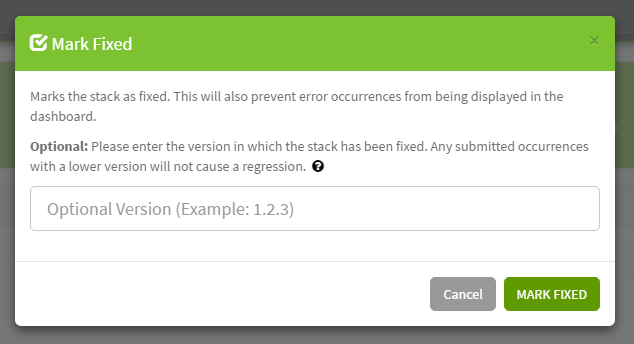

You can mark error stacks fixed and they won't show up or notify you until they regress!

## How does this work?

When an event comes into Exceptionless, we figure out what makes it unique and place it into a stack of similar events. This means that an error comes in, it will be placed in a stack of similar error events. All events may contain an application version, this can be used to track what versions of an application are causing errors or being actively used.

## How do I specify an application version?

An application version will try and be resolved if possible, but it's a good idea to specify a version if you can. Please view the client specific documentation below to learn more about setting an app version.

## Choose your Client

* [.NET](clients/dotnet/client-configuration.md)
* [JavaScript / Node.js](clients/javascript/client-configuration.md)

## What does mark fixed do?

When you mark a stack as fixed, the following meta data is recorded on the stack:

* when the stack was fixed
* and **optionally** the semantic version that you fixed this behavior in.

> **NOTE:** If you are using a **four-part version number** (E.G., `1.2.3.4`), you'll need to enter it as `1.2.3-4`. We will automatically handle this conversion when processing events.

Next, all stack event occurrences are marked as fixed and will be hidden from all dashboards. You can show fixed events in dashboards by updating the search box with `*` or `fixed:true`.

This meta data is then inspected when an matching event is processed to determine if the stack and all occurrences should be regressed (_marked not fixed_). There are two scenarios where a stack will be marked as regressed:

1. If no fixed in version is specified, any occurrence with a date newer than the date the stack was marked as fixed.
2. If a fixed in version is specified, any occurrence that has a newer version specified (Example: `1.0.0` > `1.0.0-beta`).

---

[Next > Reference Ids](references-ids) {.text-right}
