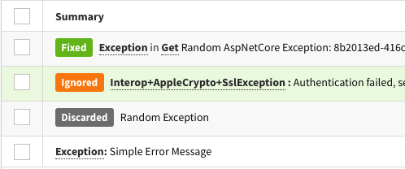
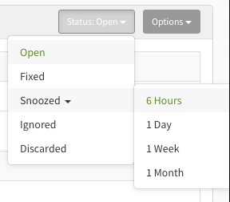
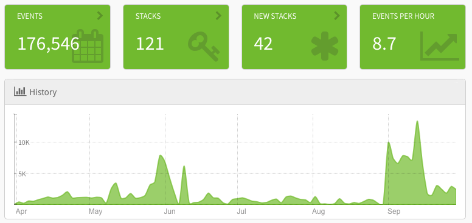

Feedback and community support is the key to growing a successful open-source company, and you all have provided us some of the best feedback possible. With your feedback, we just released one of our biggest improvements yet. This release includes changes on both the application interface and the core functionality. We wanted to highlight some of the main improvements and why we did it.

# New Statuses

This improvement is more than just visual. We heard the feedback from you loud and clear. There are stacks you don't want to track, but filtering them out on your end is difficult. For that reason, we are introducing the "Discarded" status. If you mark a stack with this status, it will not be tracked in your dashboards and, more importantly, **it won't count against your plan limits** 🎉.

As part of this improvement, we also consolidated statuses. Operations that were duplicative or didn't make sense were removed or combined. 

Adding a status means your dashboards will be updated in real-time with these statuses as quick indicators to help you understand your stacks. You can [read more about this feature and the goals we had here](https://github.com/exceptionless/Exceptionless/releases/tag/v7.0.1).

# Dashboards 

All dashboards now have a both high level stats and a timeline view by default. This gives you better information at a glance and allows you to go deeper with your stacks and events as needed. 

You'll also notice we've renamed some of our stats labels to make things a little more clear.  

# Navigation

We've made some minor adjustments to navigation icons, spacing, and more to make the experience in Exceptionless better as you move throughout the application.  

# We want to hear from you

We are constantly improving based on user feedback. If you'd like to reach out, please do so any time. You can also add your feedback at either of the two links below: 

*  [User Interface Feedback](https://github.com/exceptionless/Exceptionless.UI/issues/new)  
*  [Exceptionless Core Feedback](https://github.com/exceptionless/exceptionless/issues/new)  

Happy building!