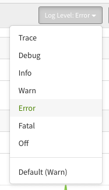
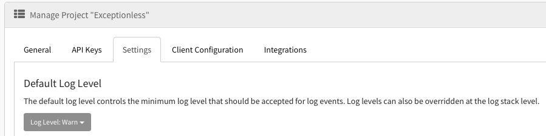

## Customize Your Log Levels on the Fly

Imagine this scenario. You're debugging your application. You KNOW there is a problem, but your logs aren't showing you anything helpful. You've bounced your head off your desk at least 34 times. Then it hits you! 

You've configured your error monitoring service to only capture FATAL errors, but this error is surely some other level. Your log level settings need to be updated. 

The good news is you've figured out what the problem is (at least what the problem is that's keeping you from debugging the real problem). The bad news is you now have to update your applications code to ensure the right log levels are being passed through to your error monitoring service. You have to save your code, re-deploy, then start re-testing. 

That's a pretty terrible experience, but fortunately, it's one that Exceptionless has solved for you. 

You can customize the log levels Exceptionless will track for you. ON. THE. FLY. You don't have to touch your code. Instead, should you run into the problem above, you can change your default log level and it will be applied immediately. Any new events coming through that match the level you set will now be stacked up and tracked for you. 

We recognize that every application is different. Every developer is different. Being able to easily customize the data captured through Exceptionless is an important part of our mission. This is why in v7.0.5, we have updated the user interface to support default log level selections.

As you can see in the image above, the current example default is "Warn." You can override that default on the Stacks page any time you'd like. But if you want to customize that default log level from the start and have it apply across the board, you can do so on your settings page.

## Why Do Log Levels Matter

Logging is key to understanding problems in your application, but it can also act as a historical record useful for post-mortems and general analysis. However, not all logs are important or necessary. And even if they are, you may want to filter them out in certain scenarios.

Enter log levels.

Log levels control what types of messages are logged. The general definition of log levels, and what we use at Exceptionless is:

TRACE  
DEBUG  
INFO  
WARN  
ERROR
FATAL  
OFF  

By setting your log levels, you are essentially saying you'd like to see information grouped into the buckets defined by the log level. For example, if you'd only like to log the most severe issues, you might select a log level of FATAL.

We want to help you with this flow by automatically accepting or ignoring errors and messages that don't match the log levels you've defined in Exceptionless. We think this will help you better manage your exceptions, reporting, and overall development flow. We can't wait to hear your feedback. If there's any questions, suggestions, or general feedback, we'd love to hear from you. You can reply here or open an issue on Github.
