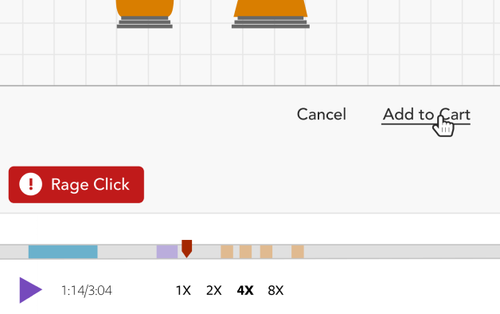
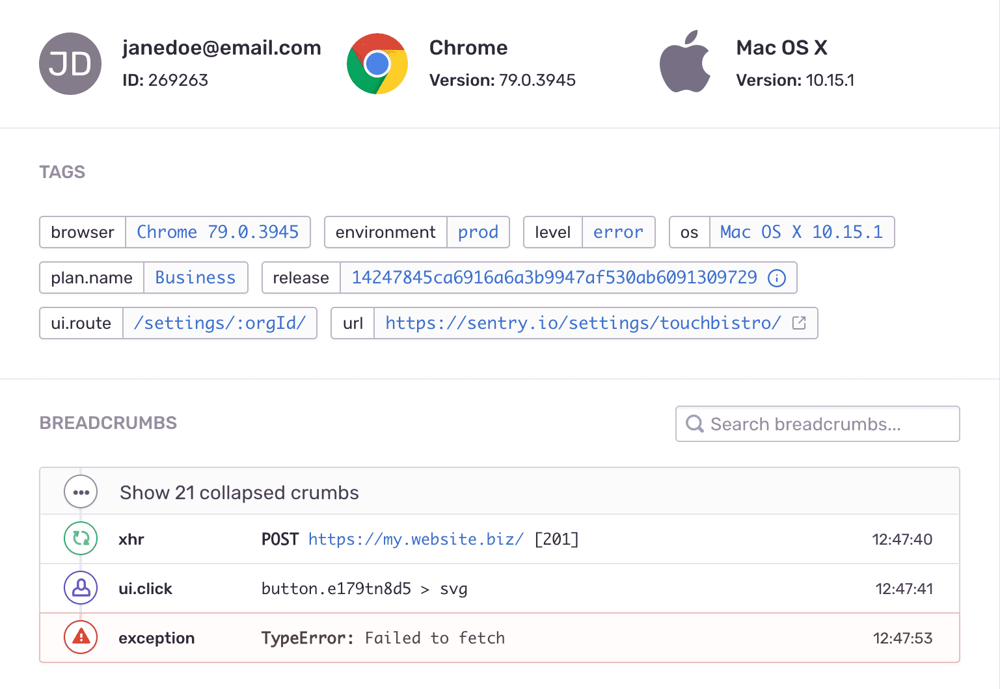

Error monitoring is vital to the success of any application. Console logs only get you so far. Once your app is out in the wild, asking your customers to open up the developer tools window and inspect it for errors is a deal-breaker. This is where error monitoring services come in. Let's take a look at three different services: 

* [Log Rocket](https://logrocket.com)
* [Sentry](https://sentry.io)
* [Exceptionless](https://exceptionless.com)

Each service, generally speaking, handles errors and logging for your applications, but not all services are created equally. Let's take a closer look at each and see how they stack up. 

# Log Rocket  

[Log Rocket](https://logrocket.com) was founded in 2015 and is an error monitoring service that focuses on replaying the events that led up to the error. While some services focus on digging into the error details themselves, Log Rocket uses HTML from the user's session to reconstruct a playback of what the user experienced. 

> What LogRocket does is we capture a recording in real time of all the user activity so the developer on the other end can replay exactly what went wrong and troubleshoot issues faster.

- [Matthew Arbesfeld, co-founder of Log Rocket](https://techcrunch.com/2019/03/21/logrocked-nabs-11m-series-a-to-fix-web-application-errors-faster/?guccounter=1&guce_referrer=aHR0cHM6Ly93d3cuZ29vZ2xlLmNvbS8&guce_referrer_sig=AQAAAIPY3DnugxcKUD8lyUXLl-FXSS29_pkxK32gWJb_Kp0lGk2YWj19tXm2PCHIjj4kFV6DBtRurKKebhBH5czcymF2Ct0k_D1UFvoJtxkD-76DSFmTqD07uaoxVS69YzFZLa-QsEcsoiwVbHWBFkLyRywxOBu8baLFu34hztJrZSCa)

Log Rocket is a venture-backed company that has raised $30 million in its history. It provides its tools exclusively as a for-profit, hosted solution. They do offer self-hosted options, but only as part of their enterprise, custom pricing. 

Their focus is on user experience through the tracking of everything a user does on the site. While this is helpful, it is also a bit invasive in the fact that the default installation of Log Rocket captures just about everything a user does in the application. 

# Sentry  

[Sentry](https://sentry.io) was founded in 2012 and is focused on capturing errors at the code-level and sending them to a repository for review and organization. Sentry allows you to configure the groupings of errors and presents them in an interface designed to surface the most-pressing errors first. 

In addition to surfacing errors, Sentry allows users to create custom alerts. For example, should a specific event occur, you can set up a trigger to send an email to your team. This is generally used for errors, but it could be used for just about any event sent through to Sentry. 

Sentry, like Log Rocket, is also a venture-backed company. They have raised over $66 million in their history. Unlike Log Rocket, Sentry provides an open-source and self-hosted solution for free. For users that do not want to pay for Sentry's hosted option, they can utilize Docker to run a self-hosted, containerized version of the Sentry platform. 

One big differentiator for Sentry is its focus on providing services for a wide array of platforms. 

> Sentry differentiates from legacy application performance monitoring solutions by focusing on software that runs on devices its developers have no control over, including mobile and IoT devices and smart sensor networks. 
- [Techcrunch, 2019](https://techcrunch.com/2019/09/24/sentry-raises-40-million-series-c-led-by-accel-for-its-error-tracking-software/)  

# Exceptionless  

[Exceptionless](https://exceptionless.com) has been around the longest of the three services reviewed here. Created as a software offering from the parent company [CodeSmith Tools](https://www.codesmithtools.com/), Exceptionless was established in 2010 and is privately held. It is positioned as a tool to help first and a product second. This is why one of Exceptionless's main focuses is the open-source community. 

Exceptionless lets developers capture logs, events, and errors. However, Exceptionless's real differentiator is its real-time delivery mechanisms. Rather than costly code deployments to change your error monitoring configurations, Exceptionless allows you to make changes from their user interface and those changes will apply instantly in your application. This is key when it becomes clear that additional errors need to be surfaced quickly. 

From the user experience and customer experience front, Exceptionless works hard to stand out from the competition. In Exceptionless 7.0, customers are now able to mark stacks of errors and logs as "discarded", the events will no longer count against plan quotas. Combine that with their chat, email, and Discord support, and Exceptionless proves its focus on customers. 

Digging into the product features, Exceptionless provides one of the cleanest views for understanding events and errors in your application. 

All the information you need about errors and events are captured in a simple, easy to read view. From your dashboard, you can consolidate events into stacks to help group relevant issues. You can also indicate the resolution of events based not just on the fact that the issue was resolve but based on the version of your software that fixed the event. Exceptionless will automatically recognize any new errors that come in with an older version and group them in the resolved bucket. However, should the error surface on the version of your software in which you marked the issue fixed, Exceptionless will classify this event as a regression without you having to manually do so.

# So Which One is Right For You?  

The answer to this often comes down to what's most important for your application. Each service has its merits, but the value provided differs based on use-cases. Log Rocket offers full session replays, but may not be the right solution for digging deep into stack traces. Sentry offers full stack trace reviews and error categorization, but it may not be the right solution if you need the ability to update your error handling configuration in real-time. Exceptionless provides real-time error monitoring and configuration, and it is committed to the open-source community. 

In the end, the choice is yours. 