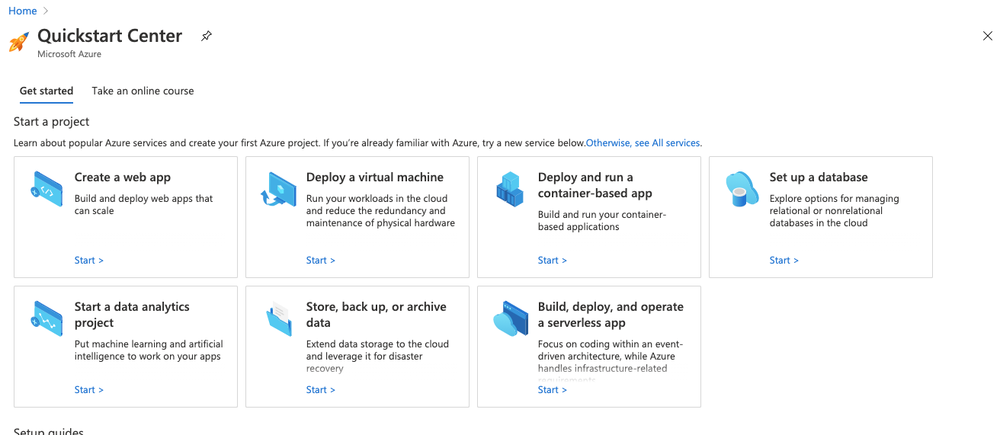
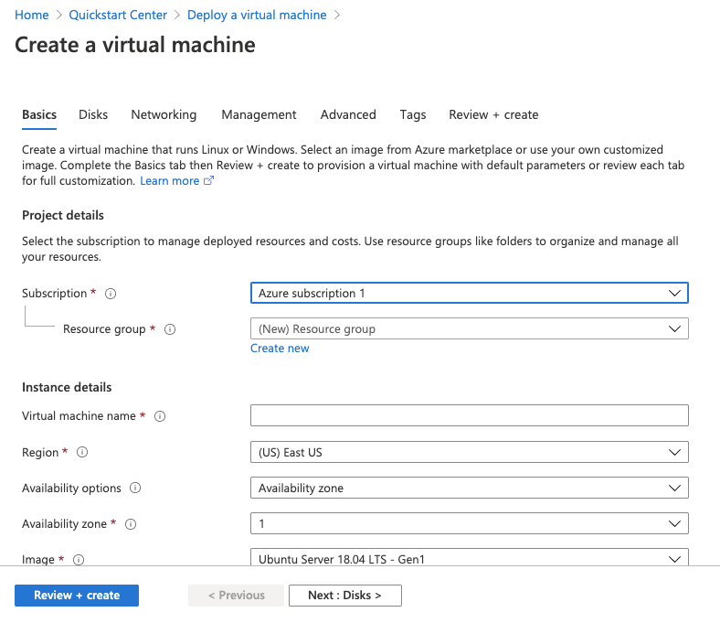
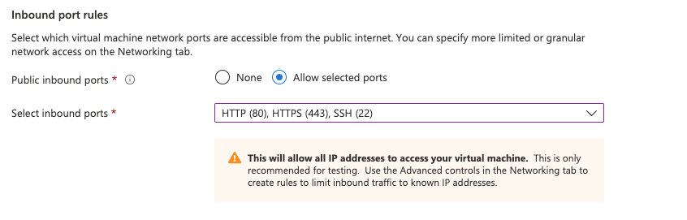
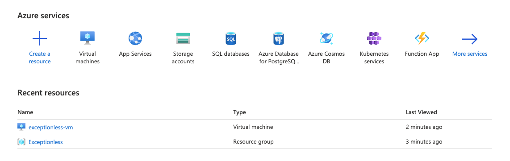

    
We [previously wrote about](https://exceptionless.com/news/2020/2020-09-30-how-to-self-host-your-error-monitoring-service/) how to run a self-hosted instance of Exceptionless locally. Today, we are going to explore how to deploy a self-hosted instance to Azure. First, let's remind you what Exceptionless is and how it's different from other error monitoring services. 

## What is Exceptionless  

Exceptionless is a cloud-based error monitoring service that focuses on real-time data injestion and configuration. Exceptionless sets itself apart from the competition through its real-time pipeline and how it combines events to make them actionable through a process called stacking. 

Unlike most error monitoring services, Exceptionless is dedicated to the open-source community and the entire code base is available on Github to inspect, contribute to, or fork. And, of course, Exceptionless can be self-hosted. 

That last bit is what we'll be focusing on today. 

## Getting Started  

To start, you'll need to sign up for a Microsoft Azure account if you don't have one already. Head on over to [Azure's Cloud Computing site](https://azure.microsoft.com/en-us/) and sign up for a free account. You'll be asked to enter your card information, but you won't be charged unless you upgrade beyond their free plan. Once you've signed up, you'll be able to go to your portal and start a project.

 {.text-center}

Click on the "Deploy virtual machine" option. You'll then have the option to create a Linux virtual machine or a Window virtual machine. We're going to be using Linux for the sake of this tutorial, so go ahead and select that option. Now, we can configure our virtual machine (VM). 

 {.text-center} 

You can leave your Subscription option as the default selection. You will need to create a resource group. Click the "Create new" button beneath the resource group section. You'll need to give this group a name. We'll call it "Exceptionless". Next, we need to give our VM a name. You can name it whatever you'd like, but I'm going to keep it simple: `exceptionless-vm`.

Next, you can change your Region if you'd like. I'm going to leave it set to the default. I will also leave my Availability Options and Availability Zone as the default. Make sure the image you select is Ubuntu Server 18.04 LTS. The next part is important. It's likely that the recommended VM instance selection is way too expensive and will blow through your free plan on Azure. You may find that you need to bump things up in the future, but for now, it's ok to start with the *B1s*. This machine will give you: 

* 1GB RAM
* 4 GB Temp Storage 
* 1 CPU  

We're not doing heavy computations with our machine, so this should be fine. 

Now, you'll need to decide how you authenticate into your VM. I highly recommend SSH but you are welcome to use username and password. If you choose the SSH route, Azure can generate the keypair for you. The final step on this page is to select your allowed inbound ports. We will change this later. For now, we're going to allow SSH, HTTP, and HTTPS while we're getting set up. 

 {.text-center} 

You can look through the other tabs in your configuration settings, but I'm going to leave everything as default. So, now we can click "Review and Create."

You'll be asked to confirm your settings. Once you do, if you chose to authenticate with an SSH key, you'll be prompted to download this keypair. Please do so and store it somewhere safe and somewhere you'll remember. Your VM should be creating now. In a few minutes, it will be accessible. 

## Accessing Your VM  

When you VM is done creating, you'll be able to click the Go To Resource button. Otherwise, when you log into your Azure account, it will be displayed as a Recent Resource: 

 {.text-center} 

Once you go to your VM resource, you'll see a Connect button at the top of the screen. Click that and you'll see instructions for connection. You'll follow the appropriate instructions for your chosen method of authentication. For me, I'll be following the SSH instructions and will document those here. 

Open the terminal client of your choice and enter the following: 

`chmod 400 PATH_TO_PEM_FILE` 

Now you can connect as a root user: 

`ssh -i <private key path> azureuser@PUBLIC_IP`

Your IP address will be listed on your Azure resource page. 

If all went well, you have now accessed your VM. However, we are accessing our machines as the root user. This isn't the best idea. So, we're going to create a new user and we will run all of our commands, installations, etc with this new user. 

`sudo adduser USERNAME`  

You'll be prompted to enter a password for this user and confirm that password. Go ahead and do that. When you're done, you'll be prompted to enter the user's information. You can just hit Enter to bypass selections here. 

Now, when you SSH into your VM, you can log in as the user you create like this: 

`sudo login`

Now, let's give our new user admin privledges. 

`sudo usermod -aG sudo USERNAME`

With all of this complete, we should be ready to install dependencies!

## Installing Dependencies  

The first thing we need to do is update our Linux instance. To do that, simply run the following command: 

`sudo apt-get update` 

Next, we're going to install dependencies for Docker, which we will use to help us self-host Exceptionless. 

```
sudo apt-get install \
    apt-transport-https \
    ca-certificates \
    curl \
    gnupg-agent \
    software-properties-common
```

Now, we need to add Docker's official GPG key. [Per their docs](https://docs.docker.com/engine/install/ubuntu/), we should run: 

`curl -fsSL https://download.docker.com/linux/ubuntu/gpg | sudo apt-key add -`

We should verify the fingerprint for the GPG key by running the following: 

`sudo apt-key fingerprint 0EBFCD88` 

The next step requires us to know the architecture our VM is running on. You can confirm this by running the following command: 

`dpkg --print-architecture`  

You should be running on an amd64 machine. But just to be safe, we'll include the instructions for amd64, armhf, and arm64.

**amd64**

```
sudo add-apt-repository \
   "deb [arch=amd64] https://download.docker.com/linux/ubuntu \
   $(lsb_release -cs) \
   stable"
```

**armhf**  

```
sudo add-apt-repository \
   "deb [arch=armhf] https://download.docker.com/linux/ubuntu \
   $(lsb_release -cs) \
   stable"
```

**arm64**  

```
sudo add-apt-repository \
   "deb [arch=arm64] https://download.docker.com/linux/ubuntu \
   $(lsb_release -cs) \
   stable"
```

Now, we'll need to run our update command again and then move on to installing the Docker engine. 

`sudo apt-get update` 

To install the engine, run: 

`sudo apt-get install docker-ce docker-ce-cli containerd.io`

Let's make sure Docker was installed successfully. Run the following to test a Docker image: 

`sudo docker run hello-world` 

If you see the results "Hello from Docker!" you're good to go.

## Running Exceptionless 

There are [three options for running a self-hosted Exceptionless instance](https://exceptionless.com/docs/self-hosting/). The first option is for testing only and will delete data between restarts. The second option retains data on disk between restarts. The third option retains data and enables email notifications. 

We're going to skip the first option and email alerts and setup is a bit more advanced than this tutorial cares to go. So, we will go with the second option. 

Per the Exceptionless documentation, this set up: 

> ...runs a simple version of Exceptionless with data persisted between runs in a sub-directory of the current directory called esdata. It uses an embedded single node Elasticsearch cluster and does not have backups. It is recommended that you create your own Elasticsearch cluster for production deployments of Exceptionless.

While it may be recommended that we run our own Elasticsearch cluster, we're not going to do that in this tutorial. 

So, let's get it going!

Run the following command: 

```
sudo docker run --rm -it -p 5000:80 \
    -v $(pwd)/esdata:/usr/share/elasticsearch/data \
    exceptionless/exceptionless:latest
```

After some initial installation, you should see a constant log output indicating that Exceptionless is running. Congratulations, the first big hurdle has been overcome! 

Now, we need to figure out how to access our instance from the outside world. It's cool to see it running in our VM, but we don't want to SSH in when we want to send events, right? Let's take care of that now. 

## Opening Ports 

If you remember, we didn't really lock down our ports when setting up our VM. We're going to make sure we can access port 5000 and lock everything else down. In reality, you'll probably want to put this all behind Nginx and only allow access to the port from specific IP addresses, but that's beyond the scope of this tutorial. 


