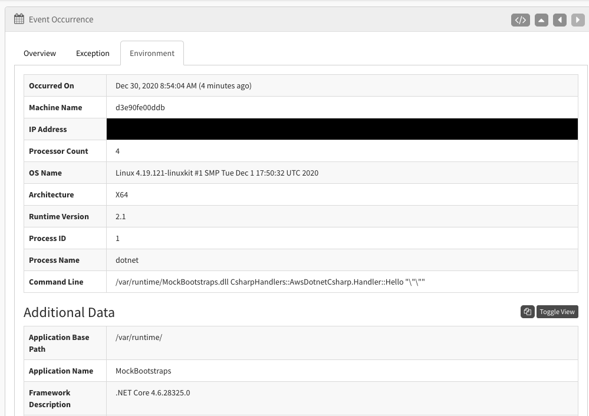
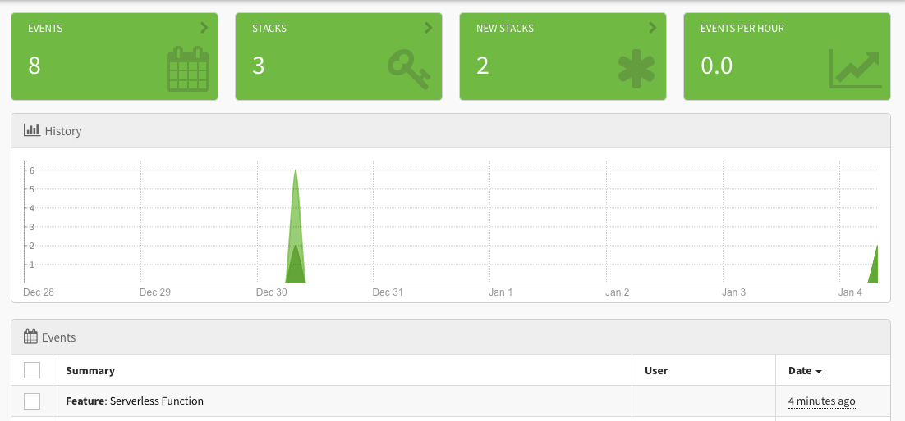

Serverless development has become the hot thing in tech. Renting time on a virtual machine only when you need it saves money and resources. However, there are many gotchas that can make working with serverless technology difficult if you're not prepared. One such gotcha is event handling. 

Unlike a Web Server applications, events in a serverless function act very similarly to console applications. Take AWS Lambda, for example. A Lambda function is going to spin up, execute, and spin down as quickly as it can. You want this. This is one of the key selling points of serverless, and how developers can ultimately save money. However, this can lead to problems when trying to process asynchronous events. We'll cover how to solve that in this post. 

Today, we're going to build a simple .NET Hello World serverless application and we're going to implement event handling to log errors and other events. We'll be using Amazon's lamba functions and the `sls` command line tool. If you don't have `sls` installed, you can follow the [install instructions here](https://www.serverless.com/framework/docs/providers/aws/guide/installation/). 

Assuming you have `sls` installed, you can create a new C# project by running the following command: 

`sls create --template aws-csharp --path myService`

This creates a very simple Hello, World example app that runs in a serverless environment. We will be running this locally and not deploying it, but if you were to deploy your .NET serverless app, you could follow the [instructions here](https://www.serverless.com/framework/docs/providers/aws/examples/hello-world/csharp#3-deploy).

We now need to add [Exceptionless](https://exceptionless.com?utm_source=serverless-blog-post) to the project. Exceptionless is an open-source event monitoring service available to all programming languages, but dedicated to .NET. Let's install it by running this command at the command line: 

`dotnet add package Exceptionless` 

This will install the most recent version of Exceptionless and is the foundation to you adding event handling in your serverless app. Once Exceptionless is installed, we can take a look at our code and see about where we might want to utilize Exceptionless. 

If you open your `myService` directory in Visual Studio (or the IDE of your choice), you'll see a `Handler.cs` file. Open that up and you'll see where our requests will be piped through. There is a simple Handler class, and within that, we have Request and Response classes. The Request class is invoked when our serverless function is called. 

We're not going to pass in any data to our serverless function for the sake of this tutorial. I'll let you experiment with that on your own. Instead, we will focus on handling errors and sending events to our Exceptionless client. 

So, let's start with error handling. We can manually force an error that will fall into the catch block of a try/catch and see how we report this to Exceptionless. 

In your Hello function, add the following: 

```csharp
var client = new ExceptionlessClient(c =>
{
  c.ApiKey = "YOUR EXCEPTIONLESS API KEY";
});
client.Startup();

try
{
  throw new Exception("myService error");
  return new Response("Go Serverless v1.0! Your function executed successfully!", request);
}
catch (Exception ex)
{
  client.SubmitException(ex);
  return new Response(ex.Message, request);
}
finally
{
  client.ProcessQueue();
}
```
    
Obviously, in the above example, we will not ever return a successful response, but you can imagine how you would use this code in a real-world example. You'll note two things we are doing that are necessary for ensuring our Exceptionless code runs in the serverless function: `client.Startup()` and `client.ProcessQueue()`. We are telling function that we've started a process and we need to make sure that process finished before the function exits. 

Let's see how our test code works. 

Run `./build.sh` to build your serverless function. Once that's complete, run `sls invoke local -f hello` to invoke it. 

The function should run, and you should receive a message that looks like this: 

```json
{
  "Message":"myService error",
  "Request":null
}
```

Now, if you checkout your Exceptionless account and go to the Exceptions dashboard, you should see an exception called "myService error." Click on that exception to get more details and you'll see that a ton of useful info is provided for you automatically: 



There are three tabs on the details page. In the above screenshot, I have selected the "Environment" tab. You can see Exceptionless automatically captured info about the user's environment, which will be very useful in debugging. I blacked out my IP address because, you know, privacy. 

Cool, so we created an exception. What about something a little more complex? 

Let's say we want to track the usage of our new serverless function. We can do that pretty easily with Exceptionless. Let's change the current try/catch block to look like this: 

```csharp
try
{
  client.SubmitFeatureUsage("Serverless Function");
  return new Response("Go Serverless v1.0! Your function executed successfully!", request);
}
catch (Exception ex)
{
  client.SubmitException(ex);
  return new Response(ex.Message, request);
}
finally
{
  client.ProccessQueue();
}
```

Here we are sending a feature usage event to Exceptionless as soon as the serverless function is triggered. The nice thing about this is that it doesn't rely on any errors being thrown and the rest of your function can continue to execute. 

In our dashboard, if we look at all event, we will see our feature usage event logged. 



## Conclusion

These types of events (features, logs, errors) because especially useful in serverless environments. Often, default logging in a serverless environment is either non-existent or much more difficult to set up. By dropping [Exceptionless](https://exceptionless.com) into your serverless application, you can track just about anything you're interested in. 