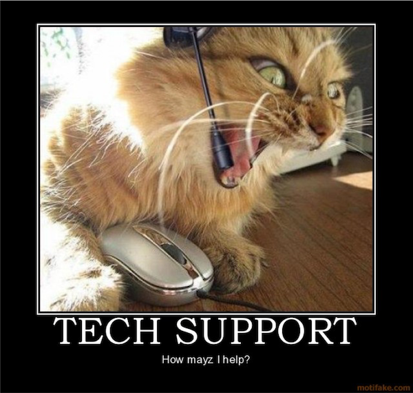

    
You've heard of test-driven development. You've heard of behavior-driven development. Maybe you've even heard of acceptance-driven development. But you probably haven't heard much about exception-driven development. Let's take a look at what that type of development process is and why you should be practicing it. 

## Exception Driven Development  

Jeff Atwood, of [Coding Horror](https://blog.codinghorror.com/), wrote a [blog post](https://blog.codinghorror.com/exception-driven-development/) almost 12 years ago about this topic. In those dozen years since his post, the need for exception-driven development has only increased, but developers and companies need a clear understanding of how and why to practice this type of development.

At a high-level, exception-driven development is simply the practice of monitoring for exceptions in your code and shipping fixes quickly. To ensure you are monitoring the right things and shipping the right fixes, all without burdening your users, you have to make sure you are collecting the right data. 

Contextual data is the key to exception-driven development. Arbitrary data from various points of input may not be useful. Data that is highly contextual to user actions, user experiences, and points in time during the use of your app will allow you to target better solutions and ship faster. 

With your contextual data in hand, you can start to fix issues. But here's the rub: You can't wait until you "have enough" fixed for a deployment. Part of the exception-driven development process is deploying often. Have a single bug that took one line to fix? Cool, ship it. Know that you'll have additional features to put out in a few days and you're considering holding your bug fix for that deployment? Don't. Ship the bug fix, then ship the features. 

Exception-driven development isn't a mysterious new process for most developers, but it is a mindset shift within many organizations. Bug fixes, listening to the data, and responsiveness must take priority if you are to transition to an exception-driven development cycle. While it may not take much effort to change your company's internal process, it may still take some convincing. So, why should you and your company practice exception-driven development?  

## Why Exception Driven Development

The first reason you should care is the most obvious reason. Your code has bugs. It does. No matter how good you are, you're going to ship bugs and you need to be ready to fix those bugs. Jeff Atwood probably said it best in his post about exception-driven development: 

> The question isn't how many bugs you will ship but how fast you can fix them.

Bugs are a part of code. Some never get fixed. But the ones that need to be fixed need to be fixed quickly. The trouble, of course, is that if you are relying on your users to tell you about these bugs, you've already taken too long to fix the issue. 

Wait, what? 

It's true. If your users have told you about bugs through email or Slack or Discord, you have already taken too long to resolve the issue. This is where the heart of exception-driven development comes in. You need to know about issues the second they arise. 

You don't want to turn into this guy, right?

 {.text-center}

Think about it this way. How many lines of code does your application have? Got that number in mind? Ok, now divide it by 1000. Take your resulting number and multiply it by 15. [That is possibly how many bugs](https://www.quora.com/What-is-the-average-ratio-of-bugs-to-a-line-of-code) you have in your software *right now*. Knowing this, don't you think it's important to try to find these bugs before your users have to tell you about them?  

By practicing exception-driven development, you make your customers happier which protects your brand image. Do you want to be the brand that has a ton of bugs or do you want to be the brand that solves problems? You also make your developers happier. Would you rather fix a bug on a piece of code shortly after you were working on it, or do you want to try to fix it six months later after you've long forgotten about that code? 

Customer retention, customer conversion, productivity, morale, and more are the reasons exception-driven development is important. Convinced yet? Good, now how do you do it?

## How to Practice Exception Driven Development  

If you remember, the first step of exception-driven development is to collect *contextual* data. Contextual data means data more than the stack trace itself. You should be collecting those traces, but the stack trace is just part of the picture. Some of the questions your contextual data should be answering include: 

* What user had this problem? 
* Where in the application did the problem occur?
* Has the problem occurred previously? 
* What actions did the user take leading up to the issue?

You can probably think of other questions you'd like answered to help you with the bugs that come in. But notice that the suggestion here is not to collect this information directly from your users. Don't wait for an email from them. Don't follow-up with questions about their operating system and browser. Collect that information upfront without the user having to take action, and you will have your contextual data. Services like [Exceptionless](https://exceptionless.com) make this easy.

But why use a service like Exceptionless? You're a developer, you can just build the solution yourself. Sure you can, but then you have to manage that solution. You have to fix bugs on that solution while also fixing bugs you've found from your actual production application. You're not in the business of running an error monitoring service. But [Exceptionless](https://exceptionless.com) is. 

Once you've collected your contextual data, you should know what to fix, where to fix it, and why it needs to be fixed. So, the logical thing to do is—well—fix it. The trick, though, is not to allow code creep to slow your release down. It's easy (trust me we all do it) to say, "oh, I'll just add this little feature or change this one other thing" when you're trying to fix a bug. You have to fight that urge, fix the bug, commit the code, and ship it. Then, you can go back and work on the shiny thing that **almost** distracted you. 

Once your code is shipped, if you are using [Exceptionless](https://exceptionless), you can mark the version that fixed the bug right within your dashboard. By doing this, you'll automatically know if you have any regressions. Exceptionless will track new occurrences of the error and compare the occurrence against the version of software the user is using and the version you marked as solving the problem. If those versions match, it's a regression. 

## Conclusion  

The whole flow of collecting data, analyzing the data, writing code, and shipping should not be foreign to you. Yet, exception-driven development is still not practiced everywhere. Hopefully, this article helps you understand why you should change your ways and how to do it. 