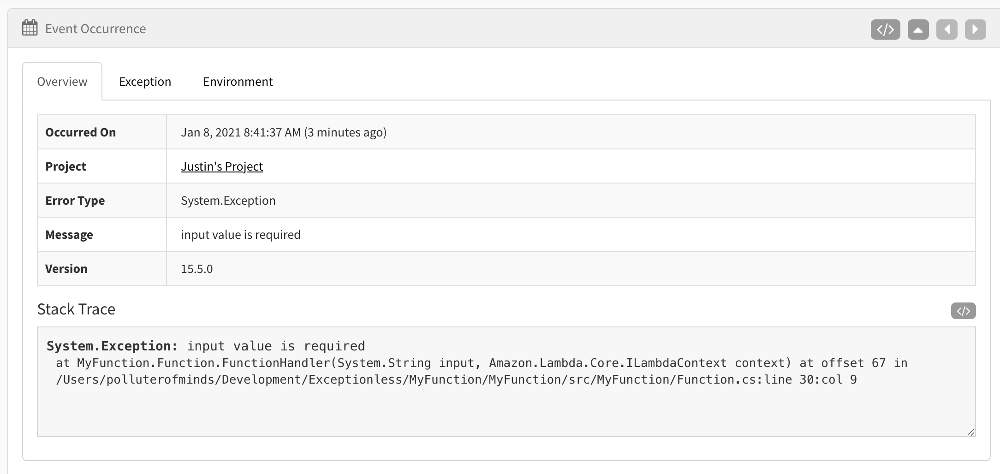

Serverless development has become the hot thing in tech. Renting time on a virtual machine only when you need it saves money and resources. However, there are many gotchas that can make working with serverless technology difficult if you're not prepared. One such gotcha is event handling. 

Unlike a Web Server applications, events in a serverless function act very similarly to console applications. Take AWS Lambda, for example. A Lambda function is going to spin up, execute, and spin down as quickly as it can. You want this. This is one of the key selling points of serverless, and how developers can ultimately save money. However, this can lead to problems when trying to process asynchronous events. We'll cover how to solve that in this post. 

Today, we're going to build a simple .NET Hello World serverless application and we're going to implement event handling to log errors and other events. We're going to use the `dotnet` cli to install a new Lambda template, but first we need to make sure we have the [Amazon Lambda Templates Package](https://www.nuget.org/packages/Amazon.Lambda.Templates). 

Once that's installed, create a new directory. I'm calling mine `MyFunction`, but you can call yours whatever you'd like. Change into that directory and run the following command: 

`dotnet new lambda.EmptyFunction --name MyFunction`

This will create your new serverless function project in .NET. If you open up your project in Visual Studio or whatever IDE or code editor you prefer, you'll see your main file is `Function.cs`. You'll also have a *very* helpful README, and a json file with some default configuration. We're not going to be editing anything besides the `Function.cs` file, but it's good to know what's provided out of the box when generating a new lambda project. 

We now need to add [Exceptionless](https://exceptionless.com?utm_source=serverless-blog-post) to the project. Exceptionless is an open-source event monitoring service available to all programming languages, but dedicated to .NET. Let's install it by running this command at the command line: 

`dotnet add package Exceptionless` 

This will install the most recent version of Exceptionless and is the foundation to you adding event handling in your serverless app. Once Exceptionless is installed, we can take a look at our code and see about where we might want to utilize Exceptionless. 

Open up the `Function.cs` file again and add the Exceptionless namespace like this: 

`using Exceptionless;`

Now, let's take a look at the function itself. It's a pretty simple function that returns a string in its uppercase form. We're going to change this around to instead return "Hello" plus the string passed in. Of course, that's not the focus of the tutorial, so we're going to also wire up error handling and event processing. 

So, let's start with error handling. We can manually force an error that will fall into the catch block of a try/catch by not passing in a string to our function. Update your function to look like this: 

```csharp
using System;
using System.Collections.Generic;
using System.Linq;
using System.Threading.Tasks;
using Exceptionless;

using Amazon.Lambda.Core;

[assembly: LambdaSerializer(typeof(Amazon.Lambda.Serialization.SystemTextJson.DefaultLambdaJsonSerializer))]

namespace MyFunction
{
  public class Function
  {

    public string FunctionHandler(string input, ILambdaContext context)
    {
      var client = new ExceptionlessClient(c =>
        {
          c.ApiKey = "YOUR EXCEPTIONLESS API KEY";
        });

      using var _ = client.ProcessQueueDeferred();

      try
      {
        if (input == null)
        {
          throw new Exception("input value is required");
        }
        return "Hello, " + input + "!";
      }
      catch (Exception ex)
      {
        client.SubmitException(ex);
        return ex.Message;
      }
    }
  }
}
```

We've added the Exceptionless namespace, we've converted the function to take in a string and return a hello world string.

To test error handling, we have set up a try/catch that will throw if no string is passed into our function. If that happens, we send the exception to Exceptionless. 

Because we need to make sure events are sent to Exceptionless before the function ends, we are using the Exceptionless method `ProcessQueueDeferred()`. 

Now, it's time to test. Fortunately, there's a super easy way to test our code before we deploy to AWS. In your root directory, find the `test` folder. Nested in that folder is a test file called `MyFunction.Test.cs`. We're going to edit this file a bit and run our tests from the command line. 

Update the file to look like this: 

```csharp
using System;
using System.Collections.Generic;
using System.Linq;
using System.Threading.Tasks;

using Xunit;
using Amazon.Lambda.Core;
using Amazon.Lambda.TestUtilities;

using MyFunction;

namespace MyFunction.Tests
{
    public class FunctionTest
    {
        [Fact]
        public void HelloWorldFunction()
        {
            var function = new Function();
            var context = new TestLambdaContext();
            var upperCase = function.FunctionHandler("John", context);

            Assert.Equal("Hello, John!", upperCase);
        }
    }
}
```

This test should pass and we should not be sending anything to Exceptionless. To test it, switch into `MyFunction/test/MyFunction.Tests` and run `dotnet test`. 

If your test passed, you're in great shape! But we don't just want to test our function. We want to make sure errors are sent to Exceptionless. So let's force an error. 

Add the following to your test file: 

```csharp
 public class ErrorTest
{
    [Fact]
    public void ErrorFunctionTest()
    {
        var function = new Function();
        var context = new TestLambdaContext();
        var helloworld = function.FunctionHandler(null, context);

        Assert.NotEqual("Hello, John!", helloworld);
    }
}
```

The test should pass because we don't get a response of "Hello, John!". But what we want to do is check to see if the exception was sent to Exceptionless. 

Open up your Exceptionless dashboard and you shoud see something like `Exception in FunctionHandler input value is required`. If you click on it, you'll see more details like this: 



There are three tabs on the details page. In the above screenshot, I have selected the "Overview" tab. However, if you explore the other tabs, you'll see value data captured for you automatically. 

Cool, so we created an exception. What about something a little more complex? 

Let's say we want to track the usage of our new serverless function. We can do that pretty easily with Exceptionless. Let's change the current try/catch block to look like this: 

```csharp
 try
{
  if (input == null)
  {
    throw new Exception("input value is required");
  }
  client.SubmitFeatureUsage("Serverless Function");
  return "Hello, " + input + "!";
}
catch (Exception ex)
{
  client.SubmitException(ex);
  return ex.Message;
}
```

Here we are sending a feature usage event to Exceptionless as soon as the serverless function is triggered and we're sure the input is not null. The nice thing about this is that it doesn't rely on any errors being thrown and the rest of your function can continue to execute. 

Let's run our tests again. We should get the feature usage event as well as an additional error because, remember, one of our tests forces a null exception. 

In our dashboard, if we look at all event, we will see our feature usage event logged. 


## Conclusion

These types of events (features, logs, errors) because especially useful in serverless environments. Often, default logging in a serverless environment is either non-existent or much more difficult to set up. By dropping [Exceptionless](https://exceptionless.com) into your serverless application, you can track just about anything you're interested in. If you'd like to see full examples of Exceptionless in Lambda functions, check out our examples [here](https://github.com/exceptionless/Exceptionless.Net/tree/master/samples/Exceptionless.SampleLambda) and [here](https://github.com/exceptionless/Exceptionless.Net/tree/master/samples/Exceptionless.SampleLambdaAspNetCore).

