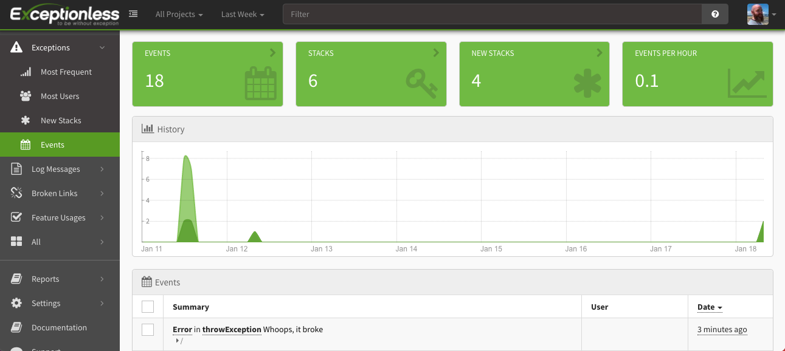
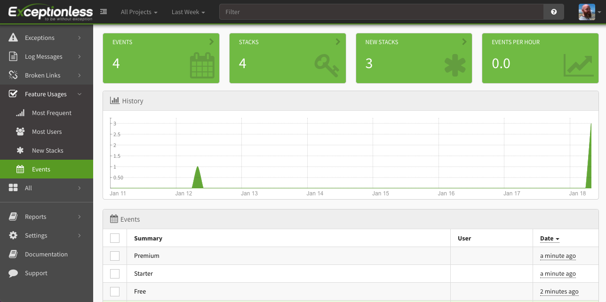

The [introduction of Hooks in React](https://reactjs.org/docs/hooks-intro.html) was a game-changer. Developers now had options when it came to creating stateful components. It used to be that if you had a stateful component, you'd have to use a class component, and if you had a presentational component, you could choose between a class or a function component. Now, with hook, state can be managed inside function components. But that's not all Hooks did for React developers. 

Hooks introduced a better way to reuse stateful functions. Today, we're going to explore how to build a custom React hook that will allow us to monitor events in our application. Those events can be errors, messages, feature usage, logs, or anything you want. There are plenty of error monitoring services out there, but we're going to make use of [Exceptionless](https://exceptionless.com) for three reasons: 

1. Real-time updates
2. It's open-source
3. The Exceptionless JavaScript client gives us a singleton option (which makes for a good example in this post)

Let's get started by starting a new React project. You'll need to have the following available on your machine: 

* Node >= 8.10
* npm >= 5.6
* Text editor

Assuming you have that ready, open up a terminal. To create a new React project, simply run: 

`npx create-react-app Monitoring-App`

Replace `Monitoring-App` with whatever you'd like to call your project. When everything is done, change into your new application's directory (`cd Monitoring-App`). Now, we need to install the Exceptionless JavaScript client. 

To do so, simple run: 

`npm install exceptionless`

When that's done installing, start your app (`npm start`) and open your project directory in the text editor of your choice. 

### What are Hooks?

React's docs have the simplest definition of Hooks and I think it's worth calling that out here: 

> Hooks are a new addition in React 16.8. They let you use state and other React features without writing a class. 

The popularity of classes in JavaScript in general has oscillated greatly. However, within the React ecosystem, it was the ONLY option for creating components that could actually do *anything*. Because many JavaScript developers do not like and do not want to use classes, the option to write function components was a huge step forward. But outside of developer preferences, React Hooks open up new ways to write code in React apps, and hopefully help you reduce your code footprint in the process. 

Hooks introduced a new way to handle lifecycle events in React as well. Gone are the `componentDidMount` and `componentDidUpdate` methods. In is the simple and elegant `useEffect` function.

You can read a lot more about the logic behind React's introduction of hooks [here](https://reactjs.org/docs/hooks-intro.html), but for the sake of this tutorial, I think that's enough of an intro.

##  Creating our first Hook 

A hook is just a function that returns a value. The big gotcha with Hooks, though, is that they can only be called within the body of a function component. Keep that in mind as we progress. It's still relatively early in the life of Hooks, but there are some standards and conventions in place. Convention is to house your custom hooks in a folder called something like `hooks`. Let's do that. 

Create a folder within the `src` directory of your project called `hooks`. Inside that folder, we're going to create a file using another convention within the React Hooks community. Developers will generally name their hooks with a `useFunctionPurpose` type of pattern. For example, if you were building a Hook that determined whether a navigation bar should show up or not, you might name the Hook file `useNavigation`. For us, we're going to call our file `useMonitoring`. 

Create that file inside the `hooks` directory, and then we can begin building the function. We'e going to go line by line and then I'll show the whole file in one snippet. Let's start by importing the necessary functions from React. 

`import { useState, useEffect } from 'react';`

I briefly touched on `useEffect`. It can be thought of in the same context as `componentDidMount` or `componentDidUpdate`. We'll make use of this to handle some logic in the setup of our Exceptionless client. `useState` can be thought of like `this.state` and `this.setState` in React class components. 

Next, we'll get access to the Exceptionless JavaScript client like this: 

`import { ExceptionlessClient } from "exceptionless/dist/exceptionless";`

Note: it's important to reference the `/dist/exceptionless` file because Exceptionless targets multiple environments and we want to make sure to import the right one. 

Next we're going to handle something I mentioned earlier. Exceptionless is a class-based client. This means we have the option of instantiating that class everytime we use it, or we can make use of a singleton provided to us out of the box by Exceptionless. We set up the singleton patter first and then we will use some logic to handle situations where that singleton may not need to be used. Go ahead and grab the `default` client from Exceptionless like this: 

`const defaultClient = ExceptionlessClient.default;`

If you haven't done so, get yourself an API Key from Exceptionless. You can [sign up for a free account here](https://exceptionless.com). Once you have that, we're going to provide that key to to the default Exceptionless client. I like to make use of environment variables even when using keys that are safe to expose in the browser. So mine looks like this: 

`defaultClient.config.apiKey = process.env.REACT_APP_EXCEPTIONLESS_API_KEY;`

Now that we've handled all our imports and initial configuration, we can frame out our hook function. The bare bones function looks like this: 

```javascript
export const useMonitoring = ({ config, useDefault }) => {
  // Code goes here
}
```

That's not much to look at, but there are two things I want to call out. The function name follows the convention I mentioned before, and this function takes two props: `config` and `useDefault`. If we are making use of the default singleton instance of the Exceptionless client, `useDefault` would be true and `config` would be null. However, if we are creating a custom instance of the Exceptionless client, `config` would be an object and `useDefault` would be either null or false. 

Let's handle that logic. At the top of your function add the following: 

`const [client, setClient] = useState(defaultClient);`

We are making use of the built-in `useState` hook here. We are simply defining a `client` state variable, defining a function that will be used to update that variable (`setClient`), and setting a defualt value for our variable. As you can see, we set the default value to use the default client from Exceptionless. Makes sense, right?

Next, we're going to use the built-in `useEffect` hook to determine what client should be returned for use in the particular part of the app that requested it. 

```javascript
useEffect(() => {
    if(useDefault) {
      return client;      
    } else if(config) {
      config.apiKey = process.env.REACT_APP_EXCEPTIONLESS_API_KEY;      
      setClient(new ExceptionlessClient(config));
    } else {
      throw "Please pass useDefault as true or a config object in";
    }
  });
```

In this case, it's best to think of our `useEffect` function in the same way you think of `componentDidUpdate`. Any update to the component that called our `useMonitoring` Hook will trigger another event within our `useEffect` function. 

If you wanted this `useEffect` method to operate more like `componentDidMount`, you would structure it like this: 

```javascript
useEffect(() => {

}, []) // <-- This array says only run this function once when the component mounts
```

The empty array in the above example can be filled with a list of dependencies. Say, for example, you want your `useEffect` method to run everytime some specific variable changes, you would just pass that variable name into the array. 

Ok back to our `useEffect` method. You can see we are checking the `useDefault` prop I mentioned before. If it is truthy, we return the client state variable. We had already set that variable to use the singleton Exceptionless client, so all we have to do is return it. If `useDefault` is falsey, we then check for the config object. If it's there, we add the apiKey to whatever values were passed into the config object, and then we instantiate a new Exceptionless client. 

If no `config` object is provided, we throw an error. You could take this a step further and check if the `config` prop is actually of type object, but, hey, that's what Typescript is for, right? We're living dangerously in this crazy, crazy dynamically typed world. 

The final thing you need to do in your `useMonitoring` function is return the client. Just as easy as it sounds: 

`return client;`

Here's the whole, complete file: 

```javascript
import { useState, useEffect } from 'react';
import { ExceptionlessClient } from "exceptionless/dist/exceptionless";
const defaultClient = ExceptionlessClient.default;
defaultClient.config.apiKey = process.env.REACT_APP_EXCEPTIONLESS_API_KEY;

export const useMonitoring = ({ config, useDefault }) => {
  const [client, setClient] = useState(defaultClient);
  useEffect(() => {
    if(useDefault) {
      return client;      
    } else if(config) {
      config.apiKey = process.env.REACT_APP_EXCEPTIONLESS_API_KEY;      
      setClient(new ExceptionlessClient(config));
    } else {
      throw "Please pass useDefault as true or a config object in";
    }
  });
  return client;
}
```

Ready to use this bad boy?

## Using your custom Hook

We created a basic React app, so let's just make use of what comes out of the box. Open your `App.js` file, and import your new custom Hook. 

`import { useMonitoring } from "./hooks/useMonitoring";`

You'll also need to import the built-in `useEffect` Hook from React: 

`import { useEffect } from 'react';`

Now, withing the main `App` function, you can use your new custom Hook: 

`const exceptionlessClient = useMonitoring({ useDefault: true });`

How can we test this now? Well, let's make use of the `useEffect` function to throw an error as soon as the component mounts. 

```javascript
useEffect(() => {
  throwException();
}, []);
```

As you remember, the empty array at the end of the function says this should only run once when the component mounts. 

Now, define the actual `throwException` function like this: 

```javascript
const throwException = () => {
  try {
    throw new Error("Whoops, it broke"); 
  } catch (error) {
    exceptionlessClient.submitException(error);
  }
}
```

Ready to test this out? If you previously started your React app, it probably already has worked. If you haven't started the app, go ahead and do that now. 

You won't see much beyond the default starter React boiletplate. But that's OK. Open up your Exceptionless dashboard, and you should see an exception has, in fact, been captured.



If you click into that exception, you'll get a bunch of additional, useful, information. You can start to see how this can be helpful. 

Now is the time where I remind you, our custom Hook can only be used within the body of your component functions. If you were to try to use your Hook in a Redux action function, you'd see an error. The beauty is, even if you're using Redux or something else, you can still throw errors back to your component and handle the error with your `useMonitoring` hook. 

But Exceptionless is more than just errors. Let's build a quick, more practical example. 

## Usage Tracking 

In your `App.js` file, we're going to remove all the boilerplate and add some ugly buttons. No styling in this post. This is what your `App.js` file should look like now: 

```javascript
import { useMonitoring } from "./hooks/useMonitoring";

function App() {
  const exceptionlessClient = useMonitoring({ useDefault: true });

  const handleButtonClick = (planName) => {
    exceptionlessClient.submitFeatureUsage(planName);
  }
  return (
    <div>
      <button onClick={() => handleButtonClick("Free")}>Free Plan - Learn More</button>
      <button onClick={() => handleButtonClick("Starter")}>Starter Plan - Learn More</button>
      <button onClick={() => handleButtonClick("Premium")}>Premium Plan - Learn More</button>
    </div>
  );
}

export default App;
```

You can see we have what might be a pricing page in an app. There are three buttons, one for each plan. We have wired up a button that will call a function that ultimately sends a feature usage event to Exceptionless. Go ahead and try clicking the buttons. 

If you go to your Exceptionless dashboard and click the Feature Usage link on the left, you'll see these events have been captured in a dedicated section that makes it easy for you to track, well, feature usage. This may not replace your analytics provider, but it goes a long way. 



## Wrapping up

There is a lot more you can do with Exceptionless. For example, you may have noticed, we have only passed in the `useDefault` prop to our custom Hook. You can completely customize your Exceptionless configuration and pass in a `config` prop instead. I would encourage you to [read up on the options here](https://exceptionless.com/docs/clients/javascript/client-configuration/). 

Exceptionless [provides a lot of methods](https://exceptionless.com/docs/clients/javascript/sending-events/) built into its JavaScript client that will make debugging, logging, and tracking easier. 