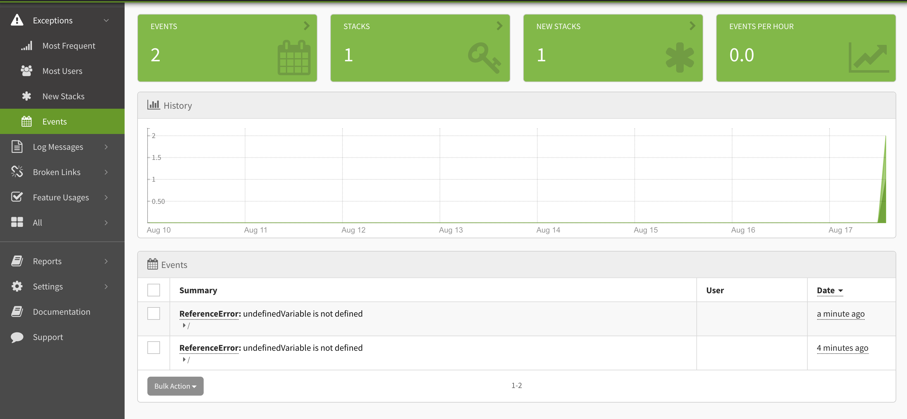

Backend engineers have all the tools. Nice error handling. Reporting. Metrics. What about us frontend devs? Sure, we can catch errors in our functions, but what about errors in our presentational code? Take React for example. Write some bad code in your function component and the whole app crashes. 

Fortunately, frontend devs are getting more and more tools to help them with error handling. In fact, with the release of React 16, a new tool was added to the toolbox designed to specifically handle errors in components. [Error Boundaries allow developers to catch and handle](https://reactjs.org/docs/error-boundaries.html) errors in the presentational layer of React applications. From the React team's announcement: 

> In the past, JavaScript errors inside components used to corrupt React’s internal state and cause it to emit cryptic errors on next renders. These errors were always caused by an earlier error in the application code, but React did not provide a way to handle them gracefully in components, and could not recover from them. 

That all changed with React 16. However, if you wanted to recover from a presentational layer error AND report it, there wasn't anything out of the box to help you. This is where [Exceptionless](https://exceptionless.com?utm_source=first_signup&utm_medium=blog&utm_campaign=error_boundary) (an open-source error handling and monitoring tool) and React work really well together. 

Let's run through a quick tutorial that creates a React app that does the following:  

* Creates an Error Boundary 
* Forces an error in a function component 
* Recovers from that error 
* Reports it to our monitoring service (Exceptionless)

## Getting Started  

For this tutorial, you will need to have the following installed: 

* Node.js v12 or greater
* NPM
* Text editor
* [Free account on Exceptionless](https://exceptionless.com?utm_source=second_signup&utm_medium=blog&utm_campaign=error_boundary)

With those things in place, let's generate our React app. From the command line, run the following: 

`npx create-react-app error-boundary-example` 

When your app is created, change into the directory and install the Exceptionless React package: 

`cd error-boundary-example && npm i @exceptionless/react` 

This should get you set up with an app and the required package. Now, let's write a bit of code to show off the functionality. We'll walk through setting up an Error Boundary first. 

## Creating an Error Boundary in React 

The first thing we need to do is create an Error Boundary file. This will act as a wrapper component for the rest of our application. In `src` folder of your React application, create a new file called `ErrorBoundary.js`. This will allow us to render a fallback when we hit an error in our component. We'll use Exceptionless's built-in Error Boundary to actually handle reporting the error. You'll see that soon, but let's focus on rendering the fallback for now. 

Inside your new file, add the following: 

```js
import React from "react";

class ErrorBoundary extends React.Component {
  constructor(props) {
    super(props);
    this.state = { hasError: false };
  }

  static getDerivedStateFromError(error) {
    return { hasError: true };
  }

  render() {
    if (this.state.hasError) {
      return (
        <div>
          <h1>Uh oh!</h1>
          <p>
            This wasn't supposed to happen. If you continue to see this message,
            please reach out to support.
          </p>
        </div>
      );
    }

    return this.props.children;
  }
}

export default ErrorBoundary;
```

This file will, again, wrap our main application code. So it will work throughout all of our components. If there's an error in a component, rather than totally crashing the application, it will render what we have in our render method here. You can change this to include whatever styling and information you'd like. I kept mine pretty simple. 

Now, we need to connect this to our application components.

## Wrapping The App Component 

You may have many providers in your application that all wrap your main `App` component. That's OK. This new Error Boundary component will simply wrap everything at the top level. Go to your `index.js` and update your file to look like this: 

```js
import React from 'react';
import ReactDOM from 'react-dom';
import './index.css';
import App from './App';
import reportWebVitals from './reportWebVitals';
import ErrorBoundary from './ErrorBoundary';

ReactDOM.render(
  <React.StrictMode>
    <ErrorBoundary>
      <App />
    </ErrorBoundary>
  </React.StrictMode>,
  document.getElementById('root')
);

reportWebVitals();
```

Now, before we handle reporting the error to Exceptionless, let's make sure this code works. Start up your application with `npm start`. We need to force an error. So, go into your `App.js` file and add an undefined variable into your component body: 

```js
import logo from './logo.svg';
import './App.css';

function App() {
  return (
    <div className="App">
      <header className="App-header">
        <p>{undefinedVariable}</p>
        
        <p>
          Edit <code>src/App.js</code> and save to reload.
        </p>
        <a
          className="App-link"
          href="https://reactjs.org"
          target="_blank"
          rel="noopener noreferrer"
        >
          Learn React
        </a>
      </header>
    </div>
  );
}

export default App;
```

You can see I've added `undefinedVariable` into the component. Because that variable is, well, undefined, the component will break. Save your code and check out the app. You'll see...

...an error message still. What gives?

Well, in development mode, React is going to try to help you out by rendering the error on screen. If you refresh the page, you should see your fallback component render for a split-second before the error appears on screen. When this code is deployed to a production environment, the error won't be displayed on screen. You know this because you've seen your production React apps crash. We all have. It shows a white screen. That's it. Now, though, your app will show the fallback screen. 

Pretty cool!

Now, we need to make sure the error is reported back to our monitoring system. We will surely get emails from customers about this, but having the details handy might help us solve the problem before our support team can even get to those emails. 

## Capturing Errors

Now that we can display a message, Let's work on capturing the error and sending it to our reporting system—Exceptionless. 

The Exceptionless React package includes an Error Boundary helper called `ExceptionlessErrorBoundary`. All we need to do is import this into our `index.js` and wrap our `App` component with it. You'll need to grab yourself an API key from your Exceptionless account for this. You can [follow this guide to do so](../../docs/api/api-getting-started.md). 

Let's take a look at what the code looks like. This is what you should update your `index.js` file to look like:

```js
import React from 'react';
import ReactDOM from 'react-dom';
import './index.css';
import App from './App';
import reportWebVitals from './reportWebVitals';
import {
  Exceptionless, 
  ExceptionlessErrorBoundary
} from "@exceptionless/react";
import ErrorBoundary from './ErrorBoundary';

const startExceptionless = async () => {
  await Exceptionless.startup((c) => {
    c.apiKey = "YOUR API KEY";
    c.useDebugLogger();

    c.defaultTags.push("Example", "React");
  });
};

startExceptionless();

ReactDOM.render(
  <React.StrictMode>
    <ErrorBoundary>
      <ExceptionlessErrorBoundary>
        <App />
      </ExceptionlessErrorBoundary>
    </ErrorBoundary>
  </React.StrictMode>,
  document.getElementById('root')
);

reportWebVitals();
```

Now go back to your React app and re-load. You won't necessarily see it there, but the error event was sent to Exceptionless. Open up your Exceptionless dashboard and take a look at the Exceptions events: 



You can click into your exceptions to get more details. In this case, we will see what the variable was and the full stack trace for our React app. 

## Wrapping Up

Error Boundaries in React are powerful tools in helping you debug and quickly fix your applications. You can see how quickly we set this up to not only render a fallback UI and to report to an error monitoring service. You could write even less code and only report the error if you wanted to, but I'll leave that up to you. 

There are plenty of error monitoring services out there that you can plug this into, but if you're interested in an open-source solution, get started with [Exceptionless](https://exceptionless.com?utm_source=third_signup&utm_medium=blog&utm_campaign=error_boundary) today. 
