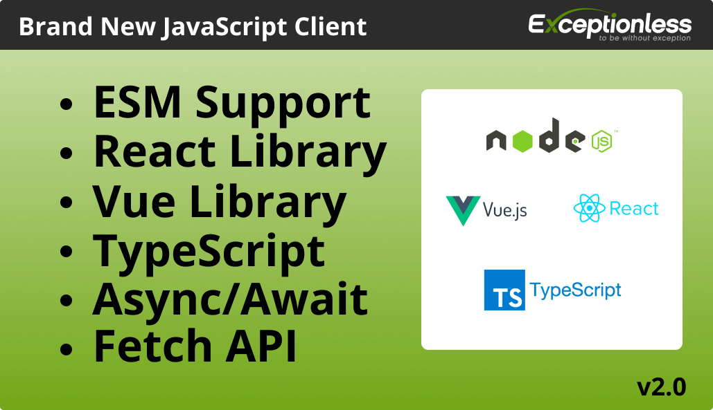
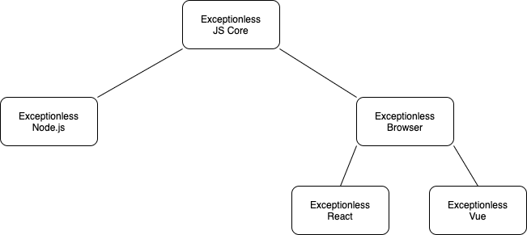

We have had a JavaScript client for several years, but it was quickly becoming out of date. To help address the issues with a fast-moving JavaScript landscape and to extend our JavaScript support, we have recently released a completely rewritten client that supports multiple JavaScript frameworks. 

If you just want to dive into the documentation, [you can review that here](../../docs/clients/javascript/index.md). If you want the story behind the rewrite, let's talk about some of the challenges we wanted to solve. 

1. Support for additional frameworks
2. Bring the client up to modern JavaScript standards 
3. Have a little more code separation
4. Provide a better developer experience

We'll talk about each one of these points in a little more detail. But first, let's dive into the architecture a bit. 

Everything starts with Exceptionless JS Core. From there, we extend into specific environment implementations. The Node.js environment has different requirements than tha browser environment. Framework-specific environments like React and Vue have different requirements than the browser environment. By starting with the Core JS implementation, we can extend in any direction to any framework. 

Speaking of frameworks...

## Support for additional frameworks 

When Exceptionless launched, the JavaScript ecosystem was powered by Bower, front-end applications were built with jQuery, and supporting IE6 was a legitimate concern on the minds of many developers. Over time, the ecosystem grew. We got React, Vue, Express, Typescript support became popular, and React Native made it easy for web devs to jump into building mobile apps. 

While Exceptionless continued to work well for most use cases, it was clear we needed an updated client to support the exploding ecosystem. React Native was one of our specific targets because Exceptionless's JS client flat-out couldn't work in React Native. But while we were at it, we wanted to make Vue.js support easier, add some native React functionality, and more. What we arrived at is a more robust client with individual sub-clients for various frameworks. 

## Bring the client up to modern JavaScript standards

ECMAScript has progressed a lot in the last ten years. It was clear that we would need to re-write our client to keep up. With our new implementation, it will be much easier to stay on top of new features and experimental features. 

The JavaScript client is a set of ESM modules built on modern JavaScript, so Exceptionless is set now and into the future. 

## Have a little more code separation

This is not a question of monorepo or not. Instead, we recognized that we were trying to cover browser code and server code all in one package. This made things difficult, not to mention we didn't yet have support for specific frameworks (besides Angular 1.0). 

Since we knew we were going to extend our support, it made sense to rebuild the client in a way that allowed us to publish updates to specific sub-modules rather than to the entire core JavaScript client every time. 

## Provide a better developer experience

Developers are at Exceptionless's core. We are developers. We are part of the open-source community. Everything we build should make life easier for developers. 

This new version of our JavaScript client makes things significantly easier. Developers can reach for a specific client module, like Vue.js for example, rather than trying to shoehorn in a vanilla JavaScript client. React developers now have Error Boundary support built into the Exceptionless client. React Native developers can now use the client instead of writing raw API requests on their own. 

---  

It took months of work, but the new Exceptionless JavaScript client is a completely rebuilt, all-new solution to event monitoring in JS. Exceptionless is proud to support the vibrant JavaScript ecosystem, and we believe this release positions us to update and stay ahead (or as close to ahead as anyone can get) of new JavaScript standards and updates into the future. 
