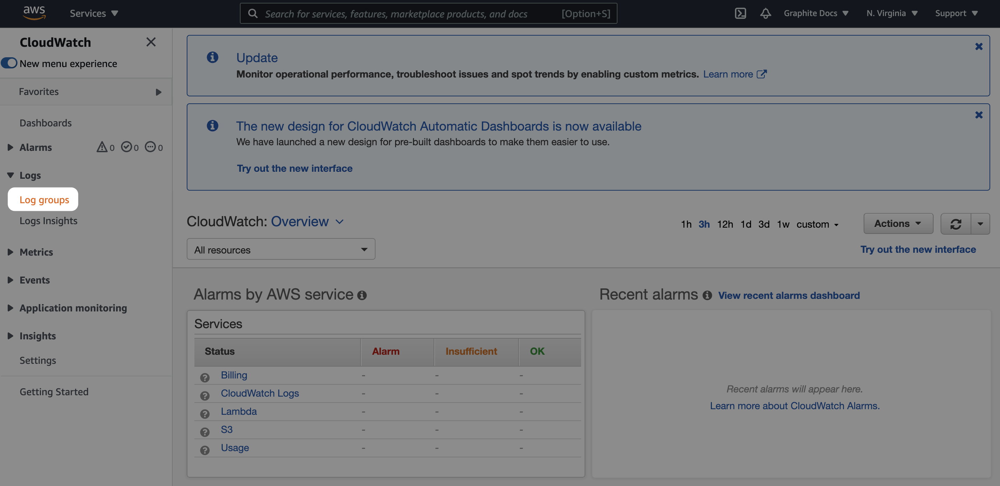
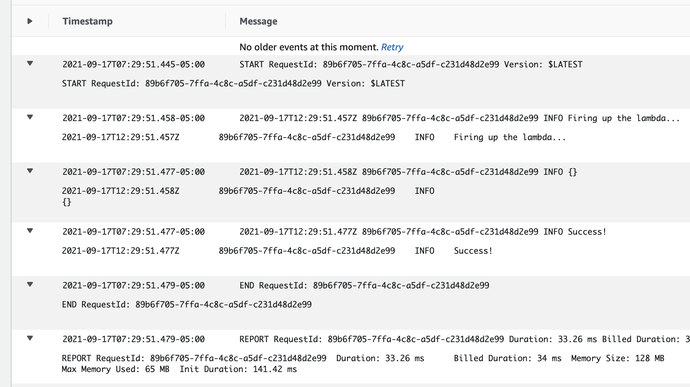
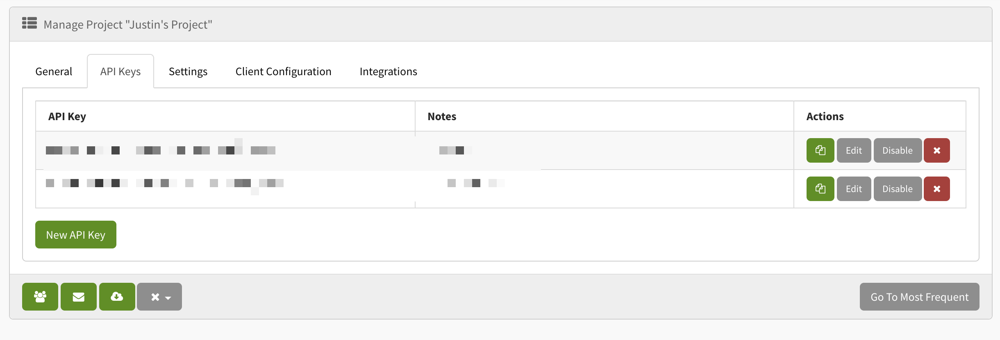

If you've spent any amount of time in AWS land, you have surely landed on the [Cloudwatch](https://aws.amazon.com/cloudwatch/) page. Maybe a critical issue sent you searching for answers and you were present by log groups and pages, and events with UTC dates you couldn't understand. Maybe you got overwhelmed trying to figure out how to filter the logs, and maybe you got tired of manually opening each log to see if that one might be the one that saves the day. 

Or maybe that's just me...

Either way, Cloudwatch is powerful, but it works better in conjunction with other tools. Before we dive into how to use Cloudwatch alongside other tools like [Exceptionless](https://exceptionless.com), it's important to highlight that there are ways to supercharge Cloudwatch. [This is a great post about how](https://www.scalyr.com/blog/aws-lambda-logging-best-practices/) using structure log data can expose better filtering and querying capabilities in Cloudwatch. 

You can and should probably make use of the above guide, but we're also going to wire things up so that any info you see in Cloudwatch that you'd like more details on can be found in Exceptionless, an open-source event monitoring tool. To follow along, you'll need an AWS free tier account, and you'll need to sign up for a free Exceptionless account. 

## What We'll Build

We are going to make this as simple as possible by building a [Lambda](https://aws.amazon.com/lambda/) function and deploying it using [Claudia.js](https://claudiajs.com/). We will connect to that function through Postman or any other rest client (or you can simply use curl from the command line). 

The intent here is not to focus so much on the build-out of the lambda but instead to watch how logging works in Cloudwatch and determine how we can layer in Exceptionless. 

## Creating The Lambda

To get started, you'll need Node.js version 8.0 or above installed on your machine and a good text editor. From the command line, in the directory where you'd like your project to live, run the following command to install Claudia: 

```
npm install claudia -g
```

This will install Claudia globally and then you can use it to generate Lambda projects. Since Claudia makes use of your AWS account, it will need to access your AWS credentials. 

Before making sure Claudia has access, let's make sure you have the AWS CLI installed. You can find the [install instructions for your machine here](https://docs.aws.amazon.com/cli/latest/userguide/install-cliv2.html). Once that is installed, run `aws configure`. This will set up your profile with credentials stored locally on your machine.

If you have not created an IAM role in AWS before, [this is a good guide](https://docs.aws.amazon.com/lambda/latest/dg/lambda-intro-execution-role.html) on doing so with permissions specific to Lambda. However, it's important to note that per the docs, the role you specify for Claudia needs the following permissions: 

* AWSLambdaFullAccess is required for all Claudia deployments
* IAMFullAccess is required if you want Claudia to automatically create execution roles for your Lambda function (recommended for beginners). If you cannot use this role due to corporate policies, or do not want to grant Claudia access to IAM, then create a Lambda execution role manually, and pass the name using --role <ROLE NAME> when executing claudia create.
* AmazonAPIGatewayAdministrator is required if you want to use Claudia API Builder, Claudia Bot Builder or deploy API Gateway Proxy APIs.

Once you have created your IAM role and have your AWS key and secret, you will need to make sure they are accessible to Claudia. The easiest way to do this is to keep them in the same credentials file as your main AWS creds on your machine. You can access the credentials file and edit it by running the following: 

```
vim ~/.aws/credentials
```

I like specifying a specifc role for tools like Claudia, so in my credentials file, I would update it to look something like this: 

```
 [default]
aws_access_key_id = DEFAULT_KEY
aws_secret_access_key = DEFAULT_SECRET

[claudia]
aws_access_key_id = DEFAULT_KEY
aws_secret_access_key = DEFAULT_SECRET
```

Once you have this set and saved, it's time to create our project. In your project folder, create a folder for your Lambda: 

```
mkdir exceptionless-lambda && cd exceptionless-lambda && npm init -y
```

Then, create a file to use as your lambda function: 

```
touch lambda.js
```

Inside your lambda file, write a simple Hello, World function to make sure this is working: 

```js
exports.handler = function (event, context) {
	context.succeed('hello world');
};
```

If you want to learn more about the model for Lambda functions, including the `event` and `context` parameters, [there's detailed info here](http://docs.aws.amazon.com/lambda/latest/dg/nodejs-prog-model-handler.html).

With this basic function in place, you can deploy your Lambda with Claudia by running: 

```
claudia create --region us-east-1 --handler lambda.handler --profile claudia
```

You can, of course, choose a different region. If you didn't use `claudia` for your AWS credentials profile name, be sure to specify the name you did use. Once this command is done, you can test your Lambda with: 

```
claudia test-lambda --profile claudia
```

This should simply print out the "hello world" statement from your Lambda. This is a good start. Next, we'll update our function to include some basic logging and see how that looks in Cloudwatch. 

## Logging With Cloudwatch

We have a basic Lambda, but let's make it so we can see some info in Cloudwatch. Update your `lambda.js` file to look like this: 

```js
exports.handler = function (event, context, callback) {
  try {
    console.log("Firing up the lambda...");
    console.log(event);
    console.log("Success!");
    context.succeed('hello world'); 
  } catch (error) {
    console.log(error);
    callback(Error(e))
  }	
};
```

To update your Lambda function, run: 

```
claudia update --profile claudia
```

Once that is updated, you can test your function again by running: 

```
claudia test-lambda --profile claudia
```

After that successfully runs, you can now go into and see the logs. You'll want to click on Log Groups on the left side: 



Then you will logs grouped by area in which they originated. You should see your lambda in the list. Click on it and then you will be taken to log streams. The most recent are at the top. If you click the top stream, you should see events for your Lambda that can be expanded. 



You can see with each event expanded that the console log statements are printed in Cloudwatch. This is useful for ad hoc checking on things, but if we want to be alerted when something happens, we may want to combine logging with error or event handling. Let's do that now!

## Connecting Exceptionless 

The first thing to do is sign up for your free [Exceptionless](https://exceptionless.com) account if you haven't done so. Once you have signed up, you can create an API key by going to your project settings page: 



Save your API Key because you'll need it here soon. We need to now install the new [Exceptionless JavaScript client](2021-09-09-announcing-the-new-exceptionless-javascript-client.md) into our Lambda project. To do this, return to your Lambda project directory and run the following: 

```
npm i @exceptionless/node
```

Once that's installed, update your Lambda code to look like this: 

```js
const { Exceptionless } = require("@exceptionless/node");

exports.handler = async function (event, context, callback) {
  try {
    await Exceptionless.startup(EXCEPTIONLESS_API_KEY);
    console.log("Firing up the lambda...");
    await Exceptionless.submitLog("Lambda fired");
    console.log("Success!");
    context.succeed('hello world'); 
  } catch (error) {
    console.log(error);
    await Exceptionless.submitException(error);
    callback(Error(e))
  }	
};
```

You can see we now have brought in Exceptionless, we start up the client, we log the fact that the lambda has fired, and just in case, we catch the exception and send it to Exceptionless. 

Let's see how this works. Update your Lambda: 

```
claudia update --profile claudia
```