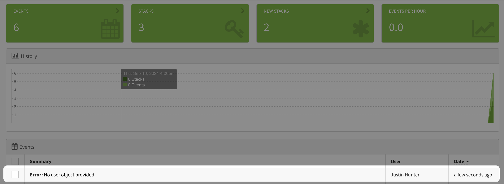
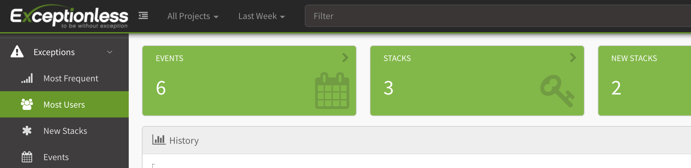

If you've ever used any error and event monitoring service, there has probably come a point where you are pulling out your hair trying to figure out if an issue is actually a major problem or if it's impacting just one user. [Exceptionless](https://exceptionless.com), an open-source event monitoring service, helps with this out of the box by making use of event stacks. But you can extend Exceptionless's functionality and automatically associate users with events. So, that one error that happens 15,000 times a day, maybe it's just a single user who wrote some bad code. 

Let's take a look at how we can associate user with events using the new [Exceptionless JavaScript client](./2021-09-09-announcing-the-new-exceptionless-javascript-client.md).

We're going to create a simple Node.js Express server, drop in Exceptionless, then track events with user details tied in. To get started, let's create a new Express project. Fire up your command line terminal and run this command: 

```
npx express-generator --no-view exceptionless-users
```

When that's done, run: 

```
cd exceptionless-users && npm install
```

If you're not familiar with Express servers, let's take a look at the project structure so understand what we'll be doing. In the project folder, there will be an entry file called `app.js`. This file tells the server what to do. The express-generator library takes care of setting this up, and it even sets up some example routes for us. You'll see a `routes` folder with an `index.js` and a `users.js` file. Each of those files contain endpoints we can make use of. 

In a real project, you'd customize this to your app's needs, but we're going to use what came out of the box with some small alterations. Before we make those alterations, let's install the Exceptionless Node.js client: 

```
npm i @exceptionless/node
```
Let's take a moment to update our new Express project to use [ESM](https://nodejs.org/api/esm.html). Start by opening the `package.json` file. We need to add a line in there that says `"type": "module",`. You can place this right above the `"script"` line. 

Then, open up your `app.js` file, and we need to convert our `require` statements to `import` statements. You'll also need to update the export at the bottom. Here's what the top of the file should look like: 

```js
import express from 'express';
import cookieParser from 'cookie-parser';
import logger from 'morgan';

import indexRouter from "./routes/index.js";
import usersRouter from "./routes/users.js";
```

The export at the bottom should be updated to look like this: 

```js
export default app;
```

Now, we need to make similar changes to our `routes` files. Open up `routes/index.js` and change the `require` statement to `import` statement like this: 

```js
import express from 'express';
```

Then, change the export to look like this at the bottom: 

```js
export default router;
```

Do the same thing in `routes/users.js` and you'll be all set.

Ok, now we can really dive in. In the `users.js` file, you can see it comes with a single GET route that will list all users. Let's set up a very simple user mapping in this file. Above the route, add the following: 

```js
const users = [
  {
    key: "123", 
    user: {
      name: "Justin Hunter", 
      email: "justin@email.com", 
      userId: "76a62f17-e177-4cc5-b2aa-49a4d59c99a5"
    }
  }, 
  {
    key: "456", 
    user: {
      name: "Sarah Sanders",
      email: "sarah@email.com", 
      userId: "6840f55b-6694-49b9-b609-40fbcbf155fe" 
    }
  }
]
```

In a real app, you'd be getting your users from a database, most likely. But we are just trying to highlight Exceptionless's event handling with user attributes, so we can hard-code things. 

Now, let's create a middleware function to check the API key on each request to our endpoints. You can add this below the `users` variable: 

```js
const authentication = (req, res, next) => {
  const apiKey = req.headers['x-api-key'];
  const keyFound = users.find(u => u.key === apiKey);
  if(!keyFound) {
    return res.status(401).send("Unauthorized");
  }
  res.locals.user = keyFound.user;
  next();
}
```

This middleware just checks to see if the key provided is a valid API Key. We could log invalid requests here in Exceptionless, but I'd rather us focus on logging valid requests so we can capture the user info. 

To test things out so far, let's update the existing GET route to use our middleware and to return a list of users. Change that route code to look like this: 

```js
router.get('/', authentication, async function(req, res, next) {
  const mappedUsers = users.map((u) => {return {
    name: u.user.name, 
    email: u.user.email, 
    userId: u.user.userId
  }});
  res.json(mappedUsers);
});
```

The route now checks for a valid API key, the it returns an array of users with their API Keys removed (security first, kids!). We can try this by running our server and making a simply HTTP request. Open up the entry file, `app.js`, and add this before the export statement: 

```js
app.listen(4000, () => {
  console.log("Server is listening on port 4000");
})
```

Then start the server: 

```
npm run start
```

Then in another command line tab, run: 

```
curl --location --request GET 'http://localhost:4000/users'
```

You should get an unauthorized response which means the middleware is doing its job. Let's add in an API Key: 

```
curl --location --request GET 'http://localhost:4000/users' \
--header 'x-api-key: 123'
```

Now, you should get back an array of two users with their API keys removed. Perfect! Now we can get started on what we came here to do—associate user data to events tracked in Exceptionless. 

Create a new endpoint in that same file that looks like this: 

```js
router.post('/', authentication, async function(req, res, next) {
  try {
    if(!validBody(req.body)) {
      throw "No user object provided";
    }
    users.push({
      apiKey: null, 
      user: req.body
    });
    res.json(req.body);
  } catch (error) {
    res.status(400).send(error);
  }
})
```

we also need to create our `validBody` function. You can add this right below the `authentication` middleware function: 

```js
const validBody = (body) => {
  if(!body.name || !body.email || !body.userId) {
    return false;
  }

  return true;
}
```

This endpoint allows anyone with a valid API key to add new users. New users should be added without an API. If the request body is empty, we will throw an error. Before wiring this up to Exceptionless, let's test this endpoint out. 

But wait, I don't want to have to keep restarting the server when we make changes. Let's make this easier. Kill your server, then run: 

```
npm i nodemon
```

In your `pacakage.json` file, add a `dev` script like this: 

```
"dev": "nodemon node ./bin/www"
```

Now, restart your server with `npm run dev`. After any changes to the code, the server will automatically restart. 

Ok, now let's test our endpoint without and with a body payload: 

```
curl --location --request POST 'http://localhost:4000/users' \
--header 'x-api-key: 123'
```

You should get an error back. Now, try with a valid body: 

```
curl --location --request POST 'http://localhost:4000/users' \
--header 'x-api-key: 123' \
--header 'Content-Type: application/json' \
--data-raw '{
    "name": "New Guy", 
    "email": "newguy@email.com",
    "userId": "97f78146-3967-4a80-972c-2fcccad6f45f"
}'
```

Now, you should get a 200 response with the newly added resource. Ok, we have our endpoint working. Let's connect it to Exceptionless so that we can track events by user. 

At the top of your file, require in Exceptionless: 

```js
import { Exceptionless } from "@exceptionless/node";
await Exceptionless.startup("YOUR API Key");
```

You can get your API key by [following these instructions](../../docs/api/api-getting-started.md). 

Now, back in your POST endpoint, let's add the following to the catch: 

```js
...
await Exceptionless.createException(error).setUserIdentity(res.locals.user).submit();
res.status(400).send(error);
```

Whenever we have an error where the body payload is invalid, we will now find the user who is making the request based on their API key and assign that user to the event that is reported to Exceptionless. 

Let's fire off a bad event again. This time, if all goes well, the user and the event will be reported back to Exceptionless. Run: 

```
curl --location --request POST 'http://localhost:4000/users' \
--header 'x-api-key: 123'
```

You will get the same error back as earlier, but if you look at your Exceptionless dashboard, you'll see the event came through and is now associated to your user. 



Why is this type of data important? Because you can now start to track both errors and events at the user level and make better decisions. Do you need to jump on the bug you just saw come through? Maybe, but first see how many users are impacted. Exceptionless can provide that information at a glance. Just click on the "Most Users" tab on the left. 



These events, of course, do not have to be tied to errors. You can track the frequency users are clicking on certain buttons. You can track page views. You can track successful interactions. All of this is powerful information that can help you build a better product. 

The source code for this simple server example is [in this gist](https://gist.github.com/polluterofminds/d055afc6be61d077e2f0871491a7c9ce).

If you're ready to jump in, install [Exceptionless](https://exceptionless.com) into your own app, and start monitoring events with user data attached!