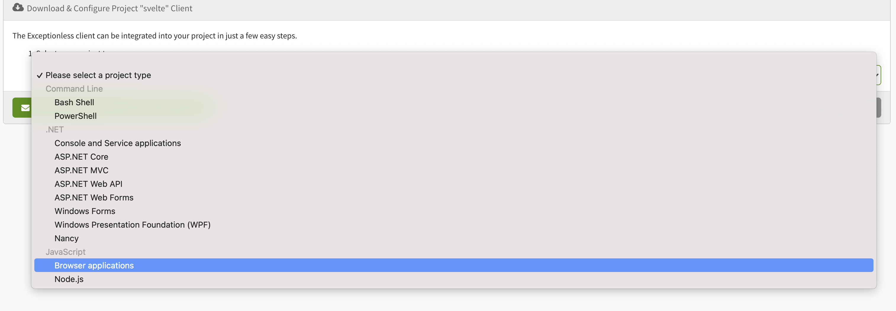

    
It seems there is a new JavaScript framework launched everyday. And while that is largely true, some standout above the rest. When [Svelte](https://svelte.dev/) first came out, it would have been easy to write it off as "yet another JS framework." However, Svelte quickly found its community. It has passionate supporters, great contributors, and was recently [named the most-loved web framework](https://insights.stackoverflow.com/survey/2021#section-most-loved-dreaded-and-wanted-web-frameworks). 

Svelte differentiates itself from other JavaScript web frameworks by NOT including a virtual DOM. Basically, it is the antithesis to React. Direct DOM manipulation was once the norm with plain old JavaScript and jQuery, but its since been replaced by the many many frameworks out there that implement a virtual/shadow DOM. 

With Svelte taking a different approach to JavaScript web frameworks, we should explore how (if at all) handling events and monitoring those events works in Svelte. Open-source ❤️ open-source, so we'll use the open-source event monitoring tool, [Exceptionless](https://exceptionless.com) alongside our Svelte app. 

What you'll need: 

* Node.js v12 or higher 
* A free Exceptionless account 
* Text editor 

## Getting Started

We'll get started by signing up for Exceptionless. Note, you can also run this locally by grabbing the source code and [following the instructions here](https://github.com/exceptionless/Exceptionless). When you have signed up, you'll be prompted to create a new project. As we create the new project, we'll be prompted ot select the type of project. For this choose "browser application": 



This will give you the install instructions, but don't worry, I'll provide those here as well. Next, click Manage Project and you'll want to grab your API key from the API keys tab. 

Now, we can generate our Svelte project. We'll use deget so that we can get a full project scaffolding set up easily. [Read more about that here](https://svelte.dev/blog/the-easiest-way-to-get-started). 

```
npx degit sveltejs/template exceptionless-svelte
cd exceptionless-svelte

npm install
```

Now, our last step before opening up a code editor is to install the new Exceptionless JavaScript client. You can do so by running this from inside your project directory: 

```
npm i @exceptionless/browser
```


