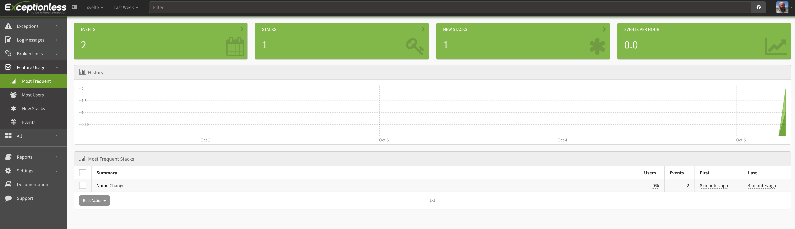
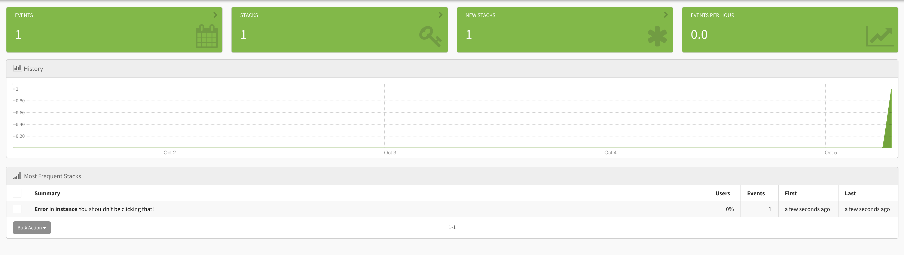

    
It seems there is a new JavaScript framework launched everyday. And while that is largely true, some standout above the rest. When [Svelte](https://svelte.dev/) first came out, it would have been easy to write it off as "yet another JS framework." However, Svelte quickly found its community. It has passionate supporters, great contributors, and was recently [named the most-loved web framework](https://insights.stackoverflow.com/survey/2021#section-most-loved-dreaded-and-wanted-web-frameworks). 

Svelte differentiates itself from other JavaScript web frameworks by NOT including a virtual DOM. Basically, it is the antithesis to React. Direct DOM manipulation was once the norm with plain old JavaScript and jQuery, but its since been replaced by the many many frameworks out there that implement a virtual/shadow DOM. 

With Svelte taking a different approach to JavaScript web frameworks, we should explore how (if at all) handling events and monitoring those events works in Svelte. Open-source ❤️ open-source, so we'll use the open-source event monitoring tool, [Exceptionless](https://exceptionless.com) alongside our Svelte app. 

What you'll need: 

* Node.js v12 or higher 
* A free Exceptionless account 
* Text editor 

## Getting Started

We'll get started by signing up for Exceptionless. Note, you can also run this locally by grabbing the source code and [following the instructions here](https://github.com/exceptionless/Exceptionless). When you have signed up, you'll be prompted to create a new project. As we create the new project, we'll be prompted ot select the type of project. For this choose "browser application": 


This will give you the install instructions, but don't worry, I'll provide those here as well. Next, click Manage Project and you'll want to grab your API key from the API keys tab. 

Now, we can generate our Svelte project. We'll use deget so that we can get a full project scaffolding set up easily. [Read more about that here](https://svelte.dev/blog/the-easiest-way-to-get-started). 

```
npx degit sveltejs/template exceptionless-svelte
cd exceptionless-svelte

npm install
```

Now, our last step before opening up a code editor is to install the new Exceptionless JavaScript client. You can do so by running this from inside your project directory: 

```
npm i @exceptionless/browser
```

Now, you can fire up the app by running: 

```
npm run dev
```

Don't worry about how it looks, we're going to instead focus on how to capture events and errors in the app using Exceptionless. Let's dive into that!

## Handling Events With Exceptionless

Svelte, like other JavaScript frameworks, allows you to build apps through a collection of components. However, to keep this tutorial simple, we will keep everything in out `App.svelte` file. So, let's start there. Open your `exceptionless-svelte` project in your favorite code editor, then find the `App.svelte` file. 

You'll notice that with Svelte, we have a normal-looking script tag at the top of the file and then some HTML. This is because there is no virtual DOM. We're really just dealing with templating, reactive state, and plain JavaScript—which is pretty fun. 

Let's import Exceptionless at the top of our script tag, and then let's start Exceptionless up. 

```js
import { Exceptionless } from "@exceptionless/browser"
const startExceptionless = async () => {
await Exceptionless.startup("YOUR API KEY");
}	
startExceptionless();
```

Notice that we had to wrap our startup call in a function. This is because [Svelte doesn't yet support to-level awaits](https://github.com/sveltejs/svelte/issues/5501). If it did, we would simply call `await Exceptionless.startup("YOUR API KEY")`. 

This `App.svelte` file doesn't have a lot going on, so let's change that. Let's make the name variable you see in our code above dynamic. We're not going to go deep into state/props with Svelte, but if you look in the `main.js` file, you'll see a prop variable called `name`. We also have that variable at the top of our `App.svelte` file. Changing it is as simple as assigning a new value. Which is exactly what we'll do. This is not the reactive way of handling state variables, so I encourage you to check out the docs [here](https://svelte.dev/tutorial/reactive-declarations). 

So, first, in the HTML, between your `main` tags, change things to look like this: 

```html
<main>
	<h1>Hello {name}!</h1>
	<p>Type a new name below to change the name variable.</p>
	<input on:change={handleChange} placeholder="new name" />
</main>
```

Then in your `script` tag, add a `handleChange` function like this: 

```js
const handleChange = (e) => {
  name = e.target.value;
}
```

Save your code, then visit localhost:5000. Type a new name in the input field and you'll see Hello World change to Hello ${new name}. Very cool. But we came here to montior events and take names!

Let's change our `handleChange` function to track that event with Exceptionless. This is a feature of our app, and Exceptionless includes a nice feature usage method in its JS client. We'll use that. 

Change the `handleChange` function to look like this: 

```js
const handleChange = async (e) => {
  name = e.target.value;
  await Exceptionless.submitFeatureUsage("Name Change");
}
```

We are submitting the name change event to Exceptionless and tracking it as a feature usage event called "Name Change". Let's take a look at how this looks in our Exceptionless dashboard. Log in again and click on the Feature Usages tab on the left. Then click on Most Frequest. Here you'll see your new Feature Usage events. 



Pretty cool, huh! There's a lot more you can layer in, including user details. This is powerful when you want to see how often particular user cohorts use a particular feature. 

Now, we can't talk about event monitoring without talking about errors, right? Let's see what error handling looks like in Exceptionless and Svelte. Let's first start by adding a button to our app and some code that will throw an error when that button is clicked. 

Under the input element in your `main` html tags, add this button: 

```html
<div>
  <button on:click={unhandledError}>Throw Error</button>
</div>
```

Then in your script tag, add the `unhandledError` function: 

```js
const unhandledError = async () => {
  throw new Error("You shouldn't be clicking that!");
}
```

We aren't even doing anything to handle this error. What?! That's because Exceptionless will automatically send unhandled errors through so you can track them. 

Go ahead and click the button. When you do so, nothing will happen. You can wire up your app to show some message if you want, but what we're really focused on is capturing the error in Exceptionless. Head over to your Exceptionless dashboard and click on Exceptions then Most Frequent. You should see something like this: 



The beauty of this is you can click all the way through that exception and see the details of the error: 


Now, what if you do want to handle errors and add in some additional context? Exceptionless has you covered. Create a new function called `handleError`: 

```js
const handleError = async () => {
  try {
    throw new Error("Handled error");
  } catch(error) {
    await Exceptionless.createException(error).addTags("handled").setUserDescription("joe@email.com", "power user").submit();
  }
}
```

You see in our catch we are adding a lot more info to the event. We are adding a tag letting us know this was a handled error (you would have much better tags, I'm sure). We are also adding a user with a description to the event. 

Let's create a button in the app and test this: 

```html
<div>
  <button on:click={handleError}>Handled Error</button>
</div>
```

Now, when you click that and go back to Exceptionless, you'll see your event come through. When you click into the details, you'll see the tags and the user information. Pretty cool, huh?

## Wrapping Up

Exceptionless is a powerful, flexible, and open-source event monitoring service. It works well with any language, but with the new JavaScript client, it works especially well with JavaScript apps and frameworks. In just a few lines of code, we were able to automate the collection of feature usage data and send errors to our Exceptionless dashboard. 

But it doesn't stop there. You can track just about anything you can imagine with [Exceptionless](https://exceptionless.com). Svelte plus Exceptionless work...uhhh...**exceptionionally** well together. Give them both a try today!

