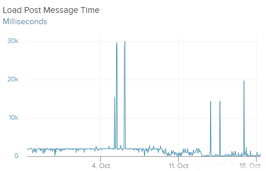
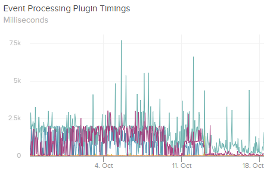

If you've followed Exceptionless for any amount of time, you would know immediately that we [are](./../2016/2016-06-28-exceptionless-4-0-net-core-asp-net-core-support.md) big [fans](../2020/2020-09-24-why-we-upgraded-our-production-application-to-net-5-0.md) of .NET. We've built the core infrastructure for Exceptionless on .NET. Our first client SDK was the .NET client. We were also one of the early adopters of .NET Core and .NET 5.0. So it should come as no surprise that we have already upgraded Exceptionless to support and use .NET 6.0. 

Before diving into what's new in .NET 6.0, let's talk about why we decided to upgrade before the official public release. We have followed the development of .NET for long enough to have a good sense of what's ready for production versus what's not. As part of our commitment to the open-source community and our commitment to .NET, we want to test release candidates with as much real-world exposure as possible. 

Obviously, we would never roll out a production upgrade that we felt was going to degrade the experience for our customers. Fortunately, that was not a concern here. We upgraded after the [second release candidate came out](https://devblogs.microsoft.com/dotnet/announcing-net-6-release-candidate-2/). This is after we tested with the first release candidat and found a major issue that we helped track down.

During our testing of RC1, we found [a compiler issue](https://github.com/dotnet/roslyn/pull/56416) that would essentially break the environment for anyone using Elasticsearch alongside the .NET library with RC1. We leverage Intellisense and many of the new features of C# to narrow down this issue and report it to the core .NET team. 

Because of the issue in RC1, we decided to wait to upgrade. When RC2 came out, we tested again and had no issues. Knowing the team behind .NET, we were more than comfortable with upgrading. And we've had no trouble at all. 

With that out of the way, let's talk about what we like about .NET 6.0. First, here are some of the high-level updates: 

* Finished .NET unification that was started in .NET 5.0
* Updates to C# 
* [File IO improvements](https://devblogs.microsoft.com/dotnet/file-io-improvements-in-dotnet-6/)
* [Date and time zone improvements](https://devblogs.microsoft.com/dotnet/date-time-and-time-zone-enhancements-in-net-6/)
* Performance improvements

It is the last point that we were most interested in. Even a small performance improvement can result in a waterfall of positive impacts across our system. We have not had enough time to test performance improvements to comment on the degree to which .NET 6.0 has improved our core infrastructure improvement, but we're excited to continue monitoring it. We can say that we have not seen any performance regressions, as you can see in the following two graphs: 

;

We continue to be impressed with the .NET team and the pace of innovation we see coming from them. Exceptionless is a language and framework agnostic event monitoring service, but .NET will always be close to our hearts. 