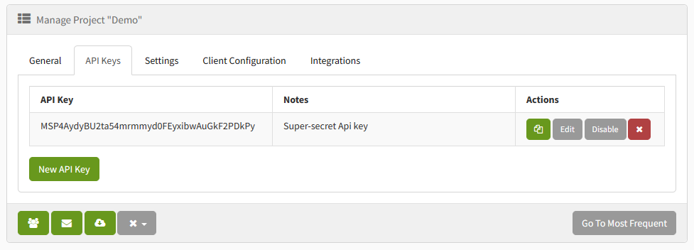
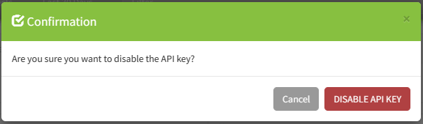

We are thrilled to announce our [latest update](https://github.com/exceptionless/Exceptionless/releases/tag/v8.0.0),
packed with new features, improvements, and bug fixes designed to elevate your
experience with our platform. With support for Discord notifications,
Elasticsearch 8, OpenTelemetry, .NET 7, and arm64, we're confident that
this release will make a significant impact. Plus, we've merged our UI codebase
into our main repo, streamlining self-hosting and development for our users.

### Unified UI and Web Project

We have merged the UI into the web project to streamline self-hosting and
development, making it easier for users to manage and maintain their projects.
This makes it much easier to deploy and get started with our project without
having to clone multiple repositories or configure multiple docker images!

## API Token Suspension:

You now have the ability to suspend API tokens, giving you greater control over
your account security. Just navigate over to your manage projects `API Keys`
tab and click on the `Disable` button.

This will bring up a modal to confirm you want to disable the API Key.

You can always reenable the API Key later by clicking on the `Enable` button.

### Expanded Notification Support

We've added the ability to send Slack webhook messages if the URL ends with
`/slack`. This feature allows you to [send notification messages](https://ptb.discord.com/developers/docs/resources/webhook#execute-slackcompatible-webhook)
to Discord and other platforms, keeping you informed about your projects.

### Elasticsearch 8 Support

Our latest update includes support for Elasticsearch 8, ensuring that you can
take advantage of the latest features and improvements offered by Elasticsearch.

### OpenTelemetry Support

We have added support for OpenTelemetry, enabling you to better monitor and
trace exactly how the exceptionless application is operating

### Arm64 Support

Our platform now supports arm64 hosting, expanding compatibility and ensuring
a seamless experience across various platforms. This not only increases
performance but saves on self hosting costs.

### Upgrade to .NET 7

We have upgraded to .NET 7, providing you with the latest features and
performance enhancements from the .NET ecosystem.

## Upgrading to 8.0

Self-hosters need to pay attention to the upgrade process for this release. If
you are self-hosting Exceptionless, please review the [Self Hosting Documentation](https://exceptionless.com/docs/self-hosting/),
which contains information about upgrading your existing installation.

## We want to hear from you

This release reflects our commitment to constantly enhancing our platform and
offering the best possible experience for our users. For a complete list of changes,
please review the [change log](https://github.com/exceptionless/Exceptionless/compare/v7.2.1...v8.0.0).

We encourage you to explore the new features and enhancements, and as always,
we welcome your feedback and suggestions.

- [.NET Client Feedback](https://github.com/exceptionless/Exceptionless.Net/issues/new)
- [JavaScript Client Feedback](https://github.com/exceptionless/Exceptionless.JavaScript/issues/new)
- [Exceptionless Feedback](https://github.com/exceptionless/exceptionless/issues/new)

The team at Exceptionless
