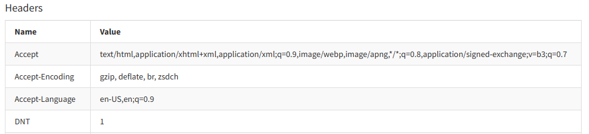

We are thrilled to announce the release of version 6 of the
[Exceptionless .NET client](https://github.com/exceptionless/Exceptionless.Net).
Our team has been working to enhance the client's out of the box functionality
and clear out the entire backlog of feature requests and issues!

## HTTP Header support

We added the ability to automatically capture available HTTP Headers when
gathering the Request Info!

The headers will be displayed on the events `Request` tab.

## Logging Improvements

We've made changes to all our logging targets like (E.G.,
[NLog](https://www.nuget.org/packages/Exceptionless.NLog),
[Microsoft.Extensions.Logging](https://www.nuget.org/packages/Exceptionless.Extensions.Logging),
[Serilog](https://www.nuget.org/packages/Serilog.Sinks.Exceptionless)) to
automatically configure the default log level to Trace via the
`ExceptionlessClient.Default.Configuration.SetDefaultMinLogLevel` method. This
method controls how we process log levels until we have server side dynamic
log levels! Now users will see logs immediately on app startup when a logging
provider is configured.

We've also updated NLog from version 4 to version 5! Bringing in many new
enhancements to the logging provider through community contribution!

## Breaking changes

We had to introduce some necessary breaking changes around serialization. Rest
assured, we've kept these breaking changes minimal and they should not effect
anyone. For more information, please refer to the
[upgrade guide](https://exceptionless.com/docs/clients/dotnet/upgrading/).

## Upgrading

Upgrading to the latest version of the Exceptionless .NET client is simple. Just
update your [NuGet package](https://www.nuget.org/packages/Exceptionless/), and
you're good to go. As always, our
[documentation](https://exceptionless.com/docs/clients/dotnet/upgrading/) is
available to help you with the upgrade process, and our support team is always
here to answer any questions you may have.

## We want to hear from you

We are constantly working to improve our .NET client and provide the best error
tracking and reporting experience for .NET developers.

* [.NET Client Feedback](https://github.com/exceptionless/Exceptionless.Net/issues/new)
* [JavaScript Client Feedback](https://github.com/exceptionless/Exceptionless.JavaScript/issues/new)
* [Exceptionless Feedback](https://github.com/exceptionless/exceptionless/issues/new)

The team at Exceptionless
